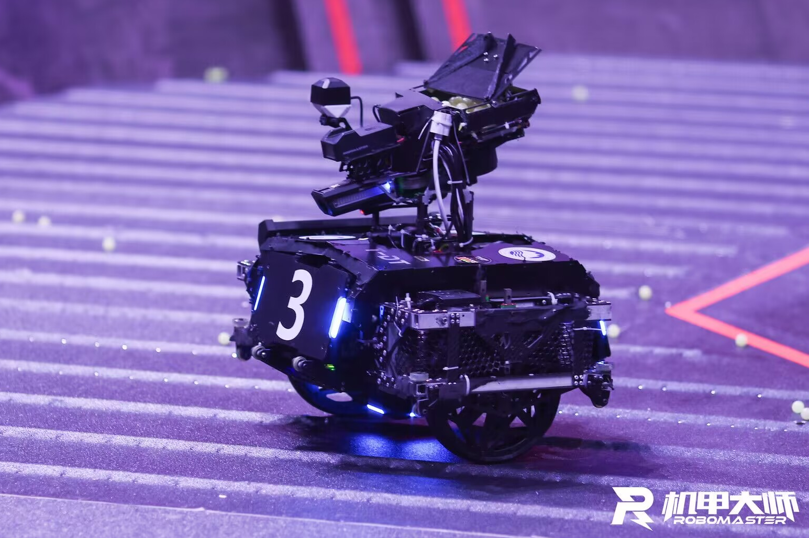
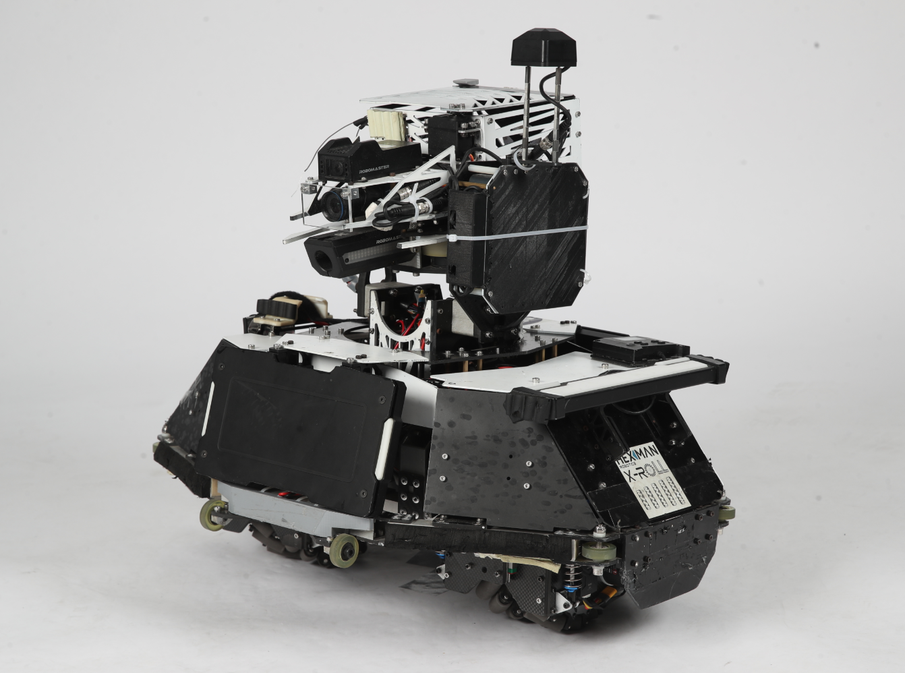
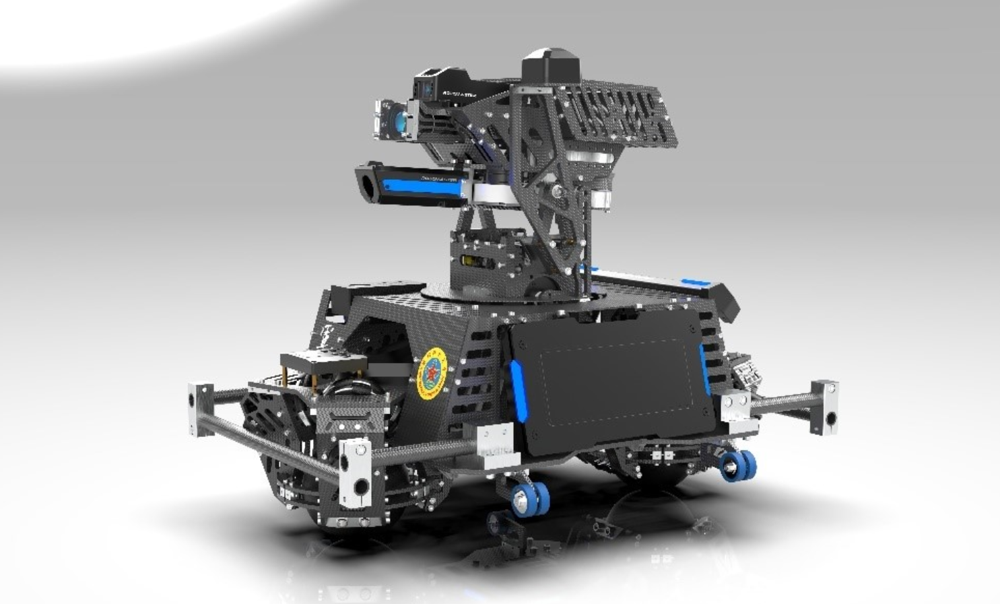
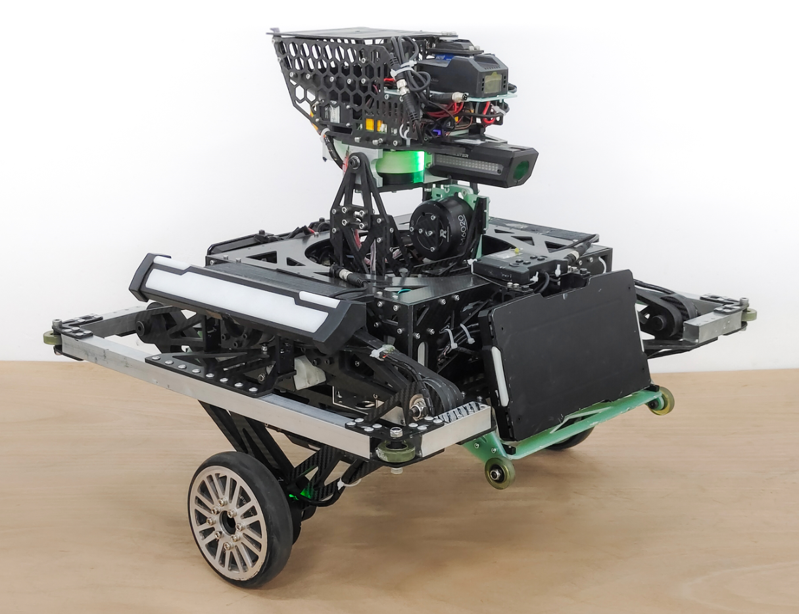
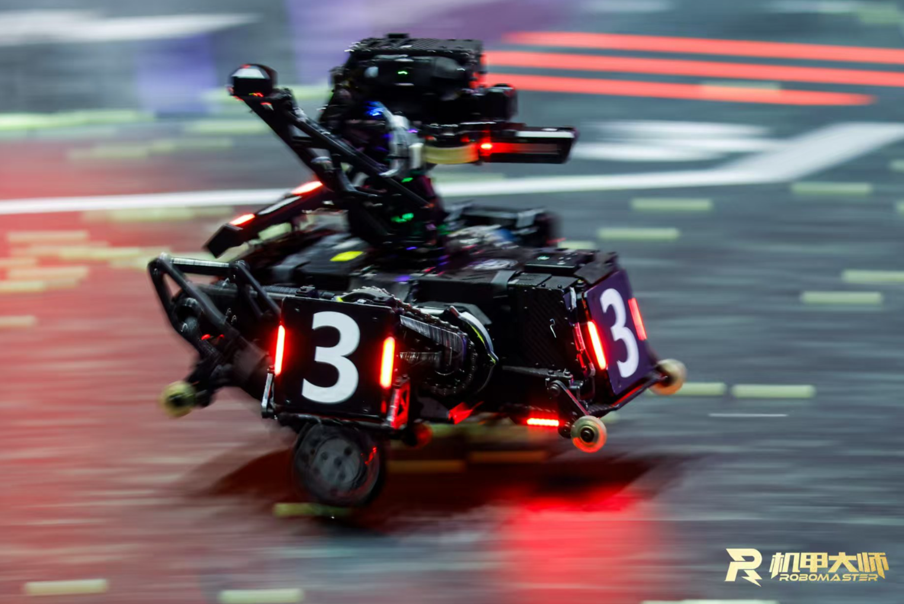
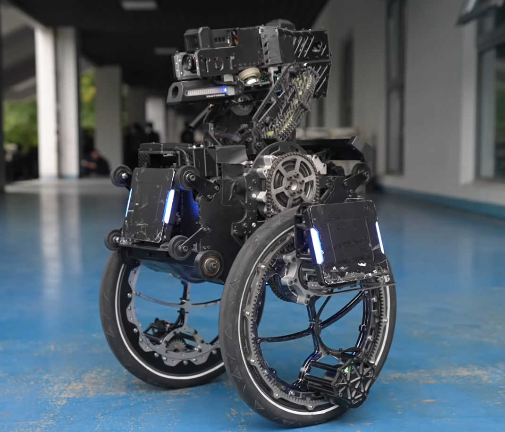

# 平衡步兵技术文档

由于26赛季的地形变动，串联腿平衡步兵在这一赛季变得尤为重要，因此本人在这里总结24赛季学习和调试平衡步兵的经验心得，希望对战队平衡步兵技术路线的发展有所帮助！

## 常见构型
- **两轮式：** 又被称为“板凳平衡”，因其结构和控制都较为简单，且引入动量块可以得到更优的控制效果，在23赛季之前被大部分队伍采用。其控制建模可以简化为一阶轮式倒立摆，采用简单的串级PID或者LQR控制器就可以得到较好的控制效果。但随着地形复杂度逐渐增加，两轮式平衡步兵的地形适应能力有限，该方案被大部分队伍摒弃。
{ width="400" style="display:block;margin:auto;" }

<b>东北大学TDT战队平衡步兵</b>

- **共轴麦轮：** 由西交利物浦大学GMaster战队开源，共轴麦轮的构型可以实现全向移动，相较于两轮式有着更强的机动性。但因为功率损耗较为严重，在功率限制的情况下无法表现出更好的性能，该方案也逐渐被摒弃。
{ width="400" style="display:block;margin:auto;" }

<b>西交利物浦大学GMaster战队平衡步兵</b>

- **球轮式：** 和共轴麦轮一样有着全向移动的能力，但由于球轮与地面为柔性接触，控制建模较为复杂，在打滑问题上也较难解决，在RM赛场上的实用性一般，好像也没有正式上场过？
{ width="400" style="display:block;margin:auto;" }

<b>国防科技大学军临战队平衡步兵</b>

- **五连杆式：** 玺佬经典力作，平衡步兵永远的神！目前最广为流传的构型，且由玺佬开源的平衡步兵控制系统现在依然被大部分队伍所使用，不管是复杂地形通过性还是抗干扰都能表现出很好的性能。
{ width="400" style="display:block;margin:auto;" }

<b>哈尔滨工程大学创梦之翼战队平衡步兵</b>

- **串联腿：** 由上海交通大学交龙战队开源，该构型可以实现腿部机构360°旋转，进而实现翻倒自救，同时由于非对称的腿部构型，在上下台阶的情况下有着更大的优势。该构型相较于传统的五连杆机构有着更强的灵活性和机动性，在最近两年被越来越多的队伍所采用。
{ width="400" style="display:block;margin:auto;" }

<b>上海交通大学交龙战队平衡步兵</b>

- **轮圈腿：** 由东北大学TDT战队开源，该构型也有着较强的地形通过性，且同样可以实现任意翻倒姿态下的自救，但目前在RM赛场上表现一般，且对操作手的要求较高？
{ width="400" style="display:block;margin:auto;" }

<b>东北大学TDT战队平衡步兵</b>

## 理论基础
笔者列出以下学习平衡步兵控制系统的前置理论知识，但是笔者非常不建议在学完以下所有内容后再去学习和调试平衡步兵，一方面因为理论知识内容很多，学完并理解以下所有知识还是需要一段时间；另一方面理论与实际工程还存在一段差距，所以笔者更推荐边学边做。

### 工程数学基础

  - 线性代数：矩阵的秩、特征值与特征向量、二次型
  - 矩阵的导数运算（雅可比矩阵）
  - 线性化与泰勒公式
  - 拉普拉斯变换

  推荐课程：
  
  - [线性代数本质](https://space.bilibili.com/88461692/lists/1528927?type=series)
  - [工程数学基础](https://space.bilibili.com/230105574/lists/1814734?type=season)
  - [矩阵导数运算](https://space.bilibili.com/230105574/lists/1814753?type=season)

### 自动控制原理
   
  - 传递函数：控制系统建模、极点与运动模态、控制系统框图
  - 时域系统：
      - 快速性分析：延迟时间、上升时间、峰值时间、调节时间、超调量
      - 稳定性分析：劳斯稳定判据
      - 准确性分析：稳态误差计算
      - 时域法校正：PID、前馈校正
  - 复域系统：根轨迹，重点理解根的作用以及主导极点，根轨迹的绘制方法可以不看
  - 频域系统：幅频/相频响应、伯德图、奈奎斯特稳定判据、幅值/相位裕度、超前/滞后校正

  推荐课程：

  - [动态系统建模与分析](https://space.bilibili.com/230105574/lists/1814739?type=season)
  - [自动控制原理—Dr_CAN](https://space.bilibili.com/230105574/lists/1814627?type=season)
  - [自动控制原理—卢京潮](https://www.bilibili.com/video/BV1F34y1h7so/?spm_id_from=333.337.search-card.all.click&vd_source=473002b338ff914cf873eb7360e432a6)

### 现代控制理论

  - 状态空间方程
  - 状态空间方程的解
  - 系统能控性和能观性
  - 李雅普诺夫方法：重点看李雅普诺夫第一法，第二法主要用于非线性系统
  - 状态反馈控制器（极点配置）
  - 状态观测器（龙伯格观测器）

  推荐课程：

  - [Advanced控制理论](https://space.bilibili.com/230105574/lists/1814743?type=season)（非线性控制理论可以先不看）
  
### 卡尔曼滤波

  - 过程模型、观测模型、高斯噪声
  - 数据融合
  - 协方差矩阵、卡尔曼增益
  - 先验估计、后验估计
  - 扩展卡尔曼滤波（EKF）

  推荐课程：

  - [卡尔曼滤波器—MATLAB官方](https://www.bilibili.com/video/BV1V5411V72J/?spm_id_from=333.337.search-card.all.click&vd_source=473002b338ff914cf873eb7360e432a6)
  - [卡尔曼滤波器—Dr_CAN](https://space.bilibili.com/230105574/lists/1814741?type=season)
  - [从全状态观测器到卡尔曼滤波器](https://zhuanlan.zhihu.com/p/338269917)

### 最优控制

  - 动态规划
  - LQR
  - MPC

  推荐课程：

  - [最优控制](https://space.bilibili.com/230105574/lists/1814750?type=season)
  - [MPC模型预测控制器](https://space.bilibili.com/230105574/lists/1814749?type=season)

### 机器人学

  - 刚体坐标变换：[旋转矩阵、欧拉角、四元数](../../相关教程/相关组件/IMU/三维旋转表示.md)
  - 正/逆运动学解算
  - 微分运动和静力学分析（雅可比矩阵求解）
  - 动力学分析：牛顿-欧拉方程、拉格朗日方程、关节空间/操作空间动力学
  
  推荐课程：
  
  - [现代机器人学](https://www.bilibili.com/video/BV1KV411Z7sC/?share_source=copy_web&vd_source=938cb8d67256b079713f07708c708374)
  - [机器人学导论](https://18636251.s21i.faiusr.com/61/ABUIABA9GAAg8LmNugYo94vmxAI.pdf)（该书侧重于机械臂的建模与控制，可以重点关注其方法而非对象）

笔者所列以上内容并非全面，只是列出了个人认为比较重要的知识，若有没有涉及到的知识点请大家自行google或联系笔者进行补充！

## 系统建模
笔者采用的是玺佬二阶轮式倒立摆建模，详细参考[RoboMaster平衡步兵机器人控制系统设计](https://zhuanlan.zhihu.com/p/563048952)。这篇文章采用的是经典力学分析，即利用牛顿-欧拉方程构建系统模型；同样可以利用拉格朗日方程，即通过对拉格朗日量求导，而无需进行受力分析就可以得到完整的动力学微分方程，且拉格朗日力学和牛顿力学完全等效。拉格朗日方程表达式如下：

$$
\frac{d}{dt}\left( \frac{\partial L}{\partial \dot{q}_i} \right) - \frac{\partial L}{\partial q_i} = 0
$$

其中，拉格朗日量定义为：

$$
L = T - V
$$

$q = [q_1, q_2, \dots, q_n]^T$ 表示为系统的广义坐标向量（可以简单理解为系统的状态变量），用于描述系统的独立自由度。$T$ 为系统动能，$V$ 为系统势能。

## LQR控制器

设计状态反馈控制器：

$$
u = -Kx
$$

定义代价函数 $J$ 为：

$$
J = \int_0^{\infty} \left( x^T Q x + u^T R u \right) dt
$$

为使代价函数最小，即 $\frac{d J}{d t} = 0$，其中输入应满足：

$$
u = -R^{-1} B^Tx
$$

其中 $P$ 满足Riccati方程：

$$
A^\top P + P A - P B R^{-1} B^\top P + Q = 0
$$

重点关注 $Q$、$R$ 矩阵的选取：

$$
Q = 
\begin{bmatrix}
1 & 0 & 0 & 0 & 0 & 0 \\
0 & 1 & 0 & 0 & 0 & 0 \\
0 & 0 & 500 & 0 & 0 & 0 \\
0 & 0 & 0 & 100 & 0 & 0 \\
0 & 0 & 0 & 0 & 5000 & 0 \\
0 & 0 & 0 & 0 & 0 & 1
\end{bmatrix},
\quad
R = 
\begin{bmatrix}
1 & 0 \\
0 & 0.25
\end{bmatrix}
$$

因为我们更加关注机体pitch的倾角变化，希望pitch的收敛速度更快，所以 $Q$ 矩阵该对角上的权重会更大；同样的，因为比赛中关节电机不计入底盘功率，我们希望关节电机的输出功率更大些，尽可能减小轮电机的输出功率，所以轮电机对应的 $R$ 矩阵对角上权重更大。

## 五连杆运动学解算与VMC

具体参考[五连杆运动学解算与VMC](https://zhuanlan.zhihu.com/p/613007726)。上交的串联腿构型可以通过虚功原理简化为四连杆机构，与五连杆机构类似，只需要将玺佬的五连杆模型中的两电机间距等于0（即AE=0），便可以使用这篇文章的方法，实现四连杆正运动学解算和VMC力矩映射。

## 离地检测

- 玺佬通过解算驱动轮所受地面支持力判断是否离地，我在24赛季直接将机体的竖直方向加速度作为驱动轮的加速度，而忽略了其他量，也基本够用。也可以引入其他量，但要注意将变量的一阶导和二阶导过一个低通滤波，否则变量变化较大会导致加速度计算不准确。
- 同时还要注意，在腿长控制时引入了机体重力作为前馈量，在机器人离地时要关闭该前馈，从而保证不会因为腿部过长而提前落地。
- 跳跃目前有两种方案：一种是给腿部虚拟力，再通过 VMC 映射为关节力矩；另一种是直接控制腿长，目前来看控制腿长的效果会更好一些。在跳跃过程中要进行分阶段控制，包括复位腿、起跳、提腿、着陆以及跳跃完成几个阶段。

## 运动速度估计

机器人在经过崎岖路面或踩到弹丸会导致轮子打滑，造成速度突变，状态反馈量不准确，系统输入量过大，最终导致整个系统彻底发散。为解决该问题，可以引入卡尔曼滤波对机体加速度和轮毂速度进行数据融合，因为相对惯性空间完全不存在打滑的概念，不会使得机体因为速度状态变量的突变而发散。具体方法参考[轮腿倒立摆机器人运动速度估计](https://zhuanlan.zhihu.com/p/689921165)。

## 控制仿真

常用的仿真软件有 MATLAB 和 Webots，可以参考笔者的[仿真开源](https://gitee.com/shuo_kai/balance-simulation)，比较适合平衡步兵控制系统的仿真学习。该仿真将二阶轮式倒立摆的摆假设为均质杆，即质心位于摆的中点，更为合理的方法是，计算不同摆长下的质心位置，并利用平行轴定理，计算摆绕质心的转动惯量，并利用多项式拟合不同摆长下的质心位置和转动惯量，可以计算出更为精准的反馈增益。

## 控制优化

- 玺佬将两条腿分开建模，并通过转向控制和双腿协调将两条腿耦合起来。也可参考[上交的全身动力学控制](https://bbs.robomaster.com/article/9430)（WBC），将两条腿作为一个整体，在考虑机体平衡的同时考虑到机体的旋转，可以进一步加强腿部的抗扰性和协调性。
- 电科中山的柳佬采用 MPC+LQR 混合控制的方法，将 MPC 的输入 u 反向叠加到 LQR 对应的腿部输入部分，可以有效防止机体姿态发生剧烈变化时腿部增益过大导致机体发散，以增加其鲁棒性。详细参考[【RM AWARD 2024】电子科技大学中山学院 RoboBraver 柳幸之 部分技术成果说明](https://bbs.robomaster.com/article/22843)

## 技术交流
{ width="60%" style="display:block;margin:auto;" }

