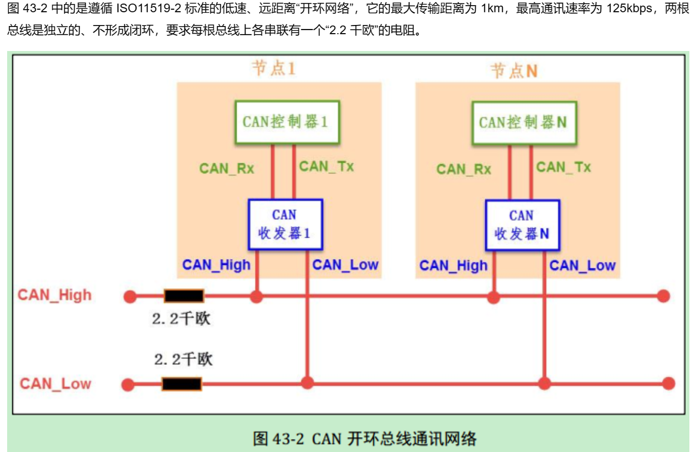
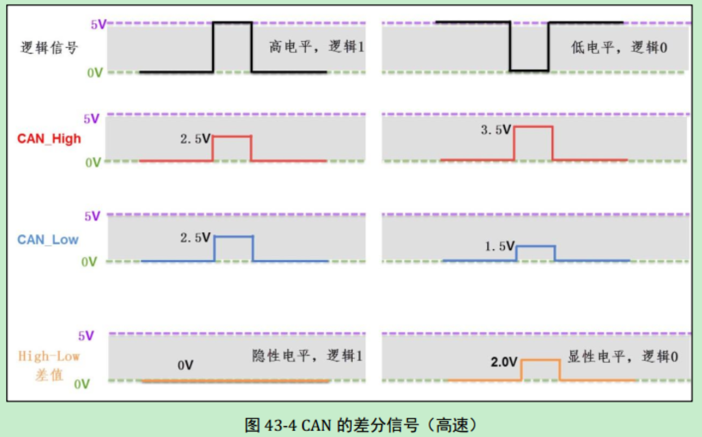
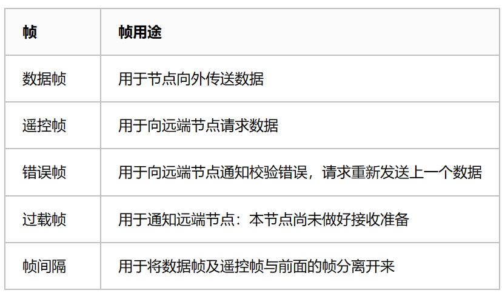
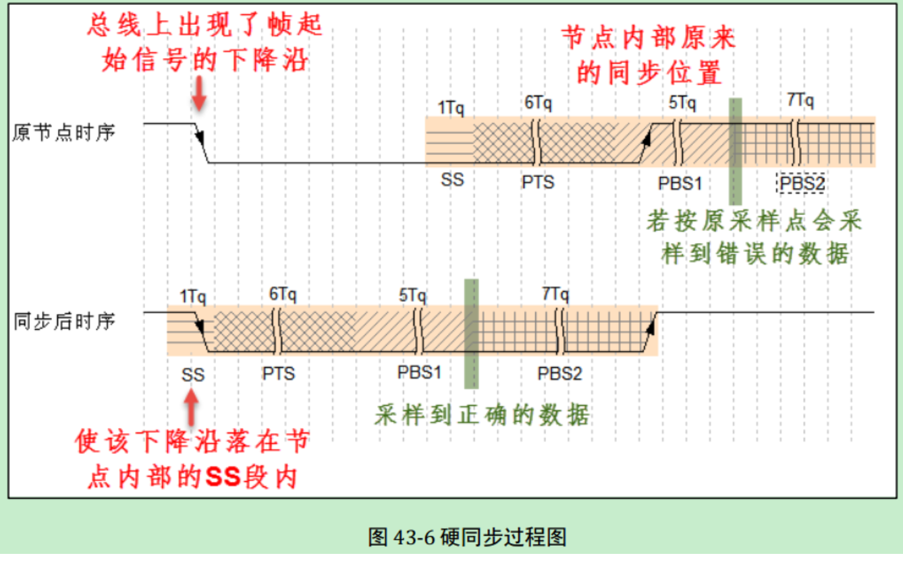
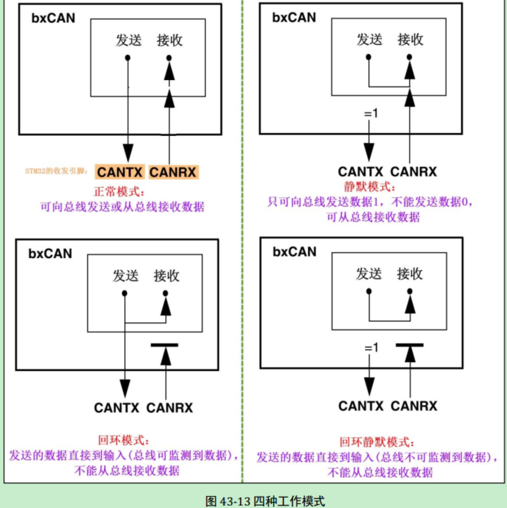
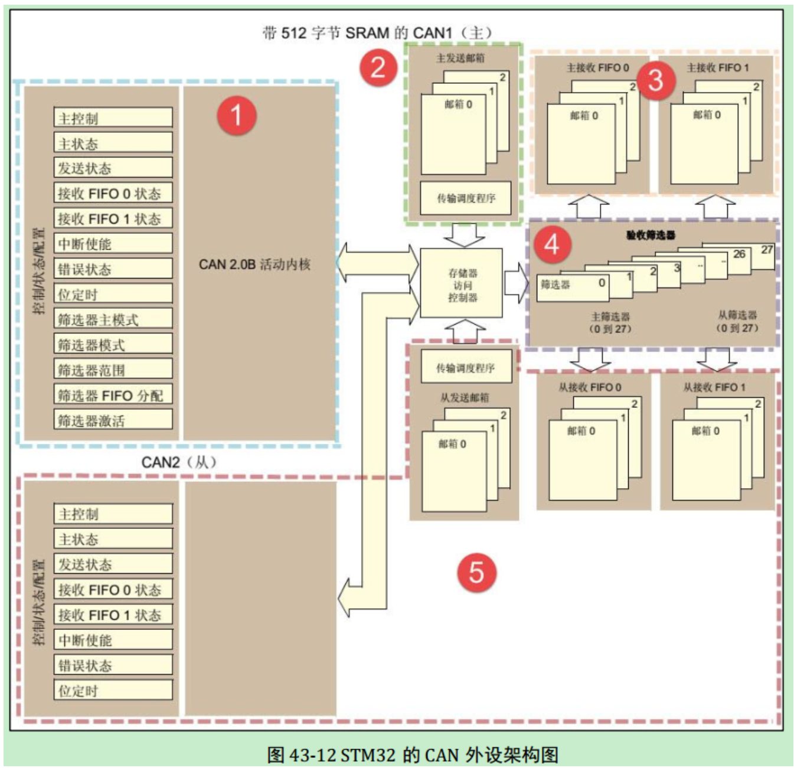
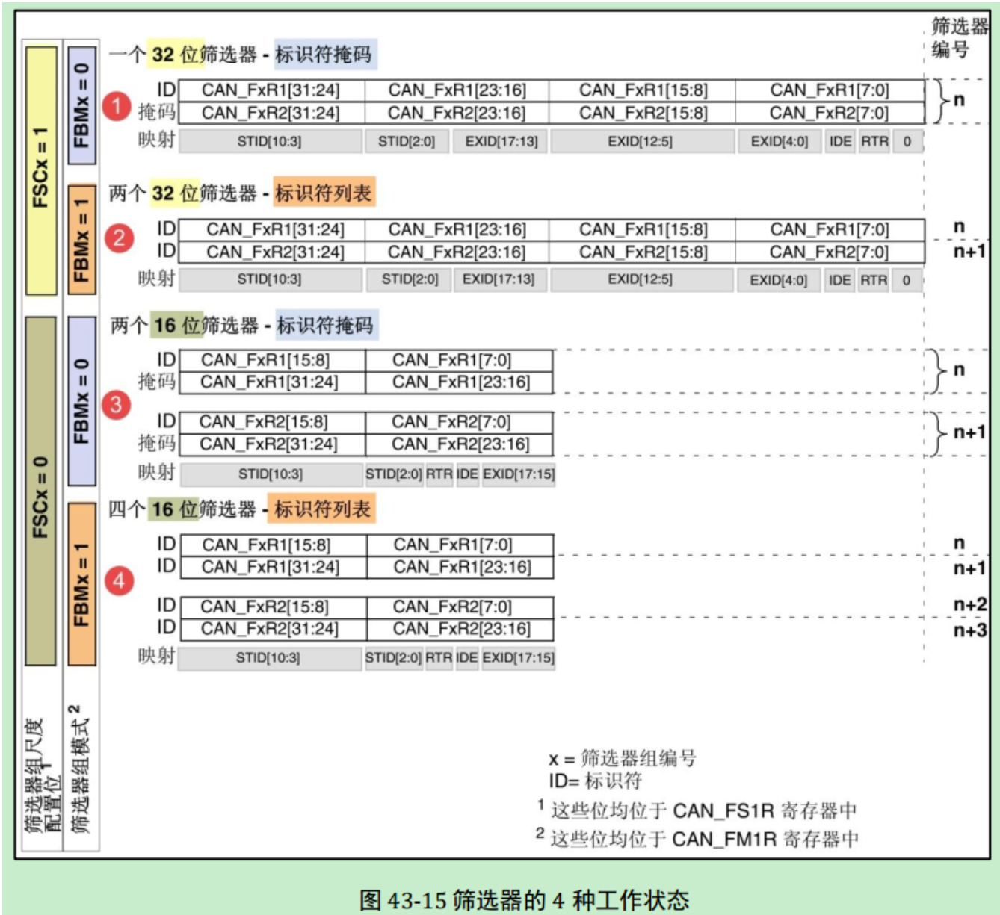
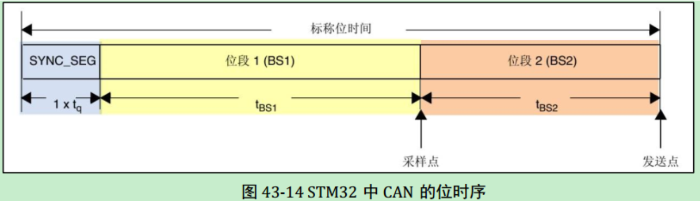
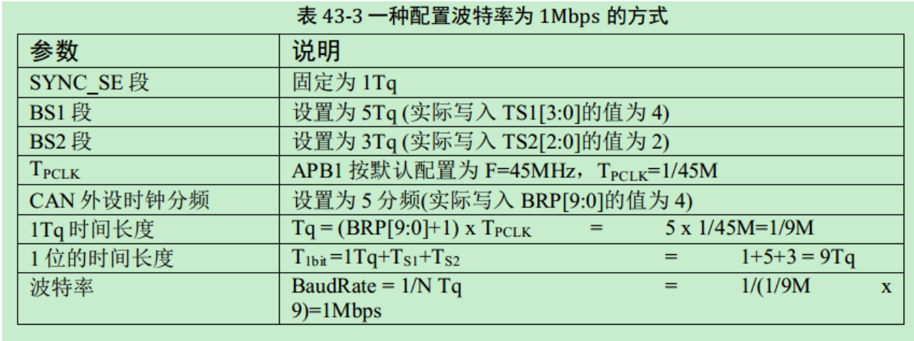

# CAN

## CAN介绍（Controller Area Network）

1. 串行通信
   
      CAN 通讯并不是以时钟信号来进行同步的，它是一种异步通讯，只具有 CAN_High 和 CAN_Low 两条信号线，共同构成一组差分信号线，以差分信号的形式进行通讯。

2. 总线通讯网络
   
      - 闭环总线网络
         
         *终端电阻用于阻抗匹配，减少回波反射*

      - 开环总线网络
         

3. 工作流程
   
      当 CAN 节点需要发送数据时， 控制器把要发送的二进制编码通过 CAN_Tx 线发送到收发器，然后由收发器把这个普通的逻辑电平信号转化成差分信号，通过差分线 CAN_High 和 CAN_Low 线输出到 CAN 总线网络。而通过收发器接收总线上的数据到控制器时，则是相反的过程，收发器把总线上收到的 CAN_High 及 CAN_Low 信号转化成普通的逻辑电平信号，通过 CAN_Rx 输出到控制器中。
       
4. 总线特点
      - 多主控制
      - 无类似地址信息
      - 通信速度快，距离远
      - 抗干扰能力强
      - 可连接多个节点

## CAN物理层

1. 差分信号
   
      差分信号又称差模信号，与传统使用单根信号线电压表示逻辑的方式有区别，使用差分信号传输时，需要两根信号线，这两个信号线的振幅相等，相位相反，通过两根信号线的电压差值来表示逻辑 0 和逻辑 1。

2. CAN协议中的差分信号
   
      以高速 CAN 协议为例，当表示逻辑 1 时(隐性电平)， CAN_High 和 CAN_Low线上的电压均为 2.5v，即它们的电压差 VH-VL=0V；而表示逻辑 0 时(显性电平)，CAN_High 的电平为 3.5V， CAN_Low 线的电平为 1.5V，即它们的电压差为 VH-VL=2V。

      

      在 CAN 总线中，必须使它处于隐性电平(逻辑 1)或显性电平(逻辑 0)中的其中一个状态。假如有两个 CAN 通讯节点，在同一时间，一个输出隐性电平，另一个输出显性电平，类似 I2C 总线的“线与”特性将使它处于显性电平状态，显性电平的名字就是这样来的， 即可以认为显性具有优先的意味。

## CAN协议层

1. 帧的种类
   
      

2. 数据帧
   
      - 数据帧结构
         

      - 帧起始：
         SOF 段(Start Of Frame)，译为帧起始，帧起始信号只有一个数据位，是一个显性电平，表示数据帧的开始。

      - 仲裁段：
         表示该帧的优先级。仲裁段的内容主要为本数据帧的 ID 信息(标识符)， 数据帧具有标准格式和扩展格式两种，区别就在于 ID 信息的长度，标准格式的 ID 为 11 位，扩展格式的 ID 为 29 位。
         - RTR (Remote Transmission Request Bit)：
           它是用于区分数据帧和遥控帧的，当它为显性电平时表示数据帧，隐性电平时表示遥控帧。
         - IDE (Identifier Extension Bit)：
           它是用于区分标准格式与扩展格式，当它为显性电平时表示标准格式，隐性电平时表示扩展格式。
         - SRR (Substitute Remote Request Bit)：
           只存在于扩展格式，它用于替代标准格式中的RTR 位。由于扩展帧中的 SRR 位为隐性位， RTR 在数据帧为显性位，所以在两个 ID相同的标准格式报文与扩展格式报文中，标准格式的优先级较高。

      - 控制段：
         在控制段中的 r1 和 r0 为保留位，默认设置为显性位。它最主要的是 DLC 段(Data Length Code)，译为数据长度码，它由 4 个数据位组成，用于表示本报文中的数据段含有多少个字节， DLC 段表示的数字为 0~8。

      - 数据段：
         数据段为数据帧的核心内容，它是节点要发送的原始信息，由 0~8 个字节组成， MSB先行。

      - CRC段：
         为了保证报文的正确传输， CAN 的报文包含了一段 15 位的 CRC 校验码，一旦接收节点算出的 CRC 码跟接收到的 CRC 码不同， 则它会向发送节点反馈出错信息，利用错误帧请求它重新发送。 CRC 部分的计算一般由 CAN 控制器硬件完成，出错时的处理则由软件控制最大重发数。在 CRC 校验码之后，有一个 CRC 界定符，它为隐性位，主要作用是把 CRC 校验码与后面的 ACK 段间隔起来。

      - ACK段：
         ACK 段包括一个 ACK 槽位，和 ACK 界定符位。类似 I2C 总线，在 ACK 槽位中，发送节点发送的是隐性位，而接收节点则在这一位中发送显性位以示应答。在 ACK 槽和帧结束之间由 ACK 界定符间隔开。

      - 帧结束：
         EOF 段(End Of Frame)，译为帧结束，帧结束段由发送节点发送的 7 个隐性位表示结束。

3. 位时序
   
      为了实现位同步， CAN 协议把每一个数据位的时序分解成如图 43-5 所示的 SS 段、PTS 段、 PBS1 段、 PBS2 段，这四段的长度加起来即为一个 CAN 数据位的长度。分解后最小的时间单位是 Tq，而一个完整的位由 8~25 个 Tq 组成。为方便表示， 图 43-5 中的高低电平直接代表信号逻辑 0 或逻辑 1(不是差分信号)。

      

      - SS段：
      SS 译为同步段， 若通讯节点检测到总线上信号的跳变沿被包含在 SS 段的范围之内，则表示节点与总线的时序是同步的，当节点与总线同步时，采样点采集到的总线电平即可被确定为该位的电平。 SS 段的大小固定为 1Tq。

      - PTS段：
      PTS 译为传播时间段，这个时间段是用于补偿网络的物理延时时间。

      - PBS1段：
      PBS1 译为相位缓冲段，主要用来补偿边沿阶段的误差。

      - PBS2 段：
      这是另一个相位缓冲段，也是用来补偿边沿阶段误差的。

4. 通讯波特率
   
      总线上的各个通讯节点只要约定好 1 个 Tq 的时间长度以及每一个数据位占据多少个Tq，就可以确定 CAN 通讯的波特率。

      例如，假设上图中的 1Tq=1us，而每个数据位由 19 个 Tq 组成，则传输一位数据需要时间 T1bit =19us，从而每秒可以传输的数据位个数为：1e6 / 19 = 52631.6 (bps)

5. 同步过程
   
      - 硬同步：
         见图 43-6，可以看到当总线出现帧起始信号时，某节点检测到总线的帧起始信号不在节点内部时序的 SS 段范围，所以判断它自己的内部时序与总线不同步，因而这个状态的采样点采集得的数据是不正确的。所以节点以硬同步的方式调整，把自己的位时序中的 SS段平移至总线出现下降沿的部分，获得同步，同步后采样点就可以采集得正确数据了。

         

      - 重新同步：
         前面的硬同步只是当存在帧起始信号时才起作用，如果在一帧很长的数据内，节点信号与总线信号相位有偏移时，这种同步方式就无能为力了。因而需要引入重新同步方式，它利用普通数据位的高至低电平的跳变沿来同步(帧起始信号是特殊的跳变沿)。

         重新同步的方式分为超前和滞后两种情况，以总线跳变沿与 SS 段的相对位置进行区分。第一种相位超前的情况如图 43-7，节点从总线的边沿跳变中，检测到它内部的时序比总线的时序相对超前 2Tq，这时控制器在下一个位时序中的 PBS1 段增加 2Tq 的时间长度，使得节点与总线时序重新同步。

         

         第二种相位滞后的情况如图 43-8，节点从总线的边沿跳变中，检测到它的时序比总线的时序相对滞后 2Tq，这时控制器在前一个位时序中的 PBS2 段减少 2Tq 的时间长度，获得同步。

         

      - 补充：
         在重新同步的时候， PBS1 和 PBS2 中增加或减少的这段时间长度被定义为“重新同步补偿宽度 SJW (reSynchronization Jump Width)”。一般来说 CAN 控制器会限定 SJW 的最大值，如限定了最大 SJW=3Tq 时，单次同步调整的时候不能增加或减少超过 3Tq 的时间长度，若有需要，控制器会通过多次小幅度调整来实现同步。当控制器设置的 SJW 极限值较大时，可以吸收的误差加大，但通讯的速度会下降。

## CAN控制器

1. 基本介绍
   
      STM32 的芯片中具有 bxCAN 控制器 (Basic Extended CAN)， 它支持 CAN 协议 2.0A 和2.0B 标准。

      该 CAN 控制器支持最高的通讯速率为 1Mb/s；可以自动地接收和发送 CAN 报文，支持使用标准 ID 和扩展 ID 的报文；外设中具有 3 个发送邮箱，发送报文的优先级可以使用软件控制，还可以记录发送的时间；具有 2 个 3 级深度的接收 FIFO，可使用过滤功能只接收或不接收某些 ID 号的报文；可配置成自动重发；不支持使用 DMA 进行数据收发。

2. 工作模式
   
      |工作模式|作用|
      |:-:|:-:|
      |初始化模式|进行软件初始化|
      |正常模式|CAN总线同步，开始接收和发送|
      |睡眠模式|降低功耗|
   
3. 测试模式

      

      - 正常模式：
         正常模式下就是一个正常的 CAN 节点，可以向总线发送数据和接收数据。

      - 静默模式：
         静默模式下，它自己的输出端的逻辑 0 数据会直接传输到它自己的输入端，逻辑1 可以被发送到总线，所以它不能向总线发送显性位(逻辑 0)，只能发送隐性位(逻辑 1)。输入端可以从总线接收内容。由于它只可发送的隐性位不会强制影响总线的状态，所以把它称为静默模式。这种模式一般用于监测，它可以用于分析总线上的流量，但又不会因为发送显性位而影响总线。

      - 回环模式：
         回环模式下，它自己的输出端的所有内容都直接传输到自己的输入端，输出端的内容同时也会被传输到总线上，即也可使用总线监测它的发送内容。输入端只接收自己发送端的内容，不接收来自总线上的内容。使用回环模式可以进行自检。

      - 回环静默模式：
         回环静默模式是以上两种模式的结合，自己的输出端的所有内容都直接传输到自己的输入端，并且不会向总线发送显性位影响总线，不能通过总线监测它的发送内容。输入端只接收自己发送端的内容，不接收来自总线上的内容。这种方式可以在“热自检”时使用，即自我检查的时候，不会干扰总线。

      - 注意：
         以上说的各个模式，是不需要修改硬件接线的，如当输出直连输入时，它是在 STM32芯片内部连接的，传输路径不经过 STM32 的 CAN_Tx/Rx 引脚，更不经过外部连接的 CAN收发器，只有输出数据到总线或从总线接收的情况下才会经过 CAN_Tx/Rx 引脚和收发器。

4. 控制器框图

      STM32 的有两组 CAN 控制器，其中 CAN1 是主设备，框图中的“存储访问控制器”是由 CAN1 控制的， CAN2 无法直接访问存储区域，所以使用 CAN2 的时候必须使能CAN1 外设的时钟。框图中主要包含 CAN 控制内核、发送邮箱、接收 FIFO 以及验收筛选器。

      

      - CAN内核：
         包含各种控制/状态/配置寄存器，可配置模式、波特率等。

      - 发送邮箱：
         用来缓存待发送报文，最多可以缓存3个报文。

         每个发送邮箱中包含有标识符寄存器 CAN_TIxR、数据长度控制寄存器 CAN_TDTxR及 2 个数据寄存器 CAN_TDLxR、 CAN_TDHxR。

         

      - 接收FIFO：
         缓存接收到的有效报文。

         一共有 2 个接收 FIFO，每个 FIFO 中有 3 个邮箱，即最多可以缓存 6 个接收到的报文。当接收到报文时， FIFO 的报文计数器会自增，而 STM32 内部读取 FIFO 数据之后，报文计数器会自减，我们通过状态寄存器可获知报文计数器的值，而通过前面主控制寄存器的 RFLM 位，可设置锁定模式，锁定模式下 FIFO 溢出时会丢弃新报文，非锁定模式下 FIFO 溢出时新报文会覆盖旧报文。

         

      - 验收筛选器：
         筛选有效报文。

         CAN 外设框图中，在标号4处的是 CAN 外设的验收筛选器，一共有 28 个筛选器组，每个筛选器组有 2 个寄存器， CAN1 和 CAN2 共用筛选器。
         
         筛选器工作的时候，可以调整筛选 ID 的长度及过滤模式。根据筛选 ID 长度来分类有：

         - 检查 STDID[10:0]、 EXTID[17:0]、 IDE 和 RTR 位，一共 31 位。

         - 检查 STDID[10:0]、 RTR、 IDE 和 EXTID[17:15]，一共 16 位。
         通过配置筛选尺度寄存器 CAN_FS1R 的 FSCx 位可以设置筛选器工作在哪个尺度

         而根据过滤的方法分为以下两种模式：

         - 标识符列表模式，它把要接收报文的 ID 列成一个表，要求报文 ID 与列表中的某一个标识符完全相同才可以接收，可以理解为白名单管理。

         - 掩码模式，它把可接收报文 ID 的某几位作为列表，这几位被称为掩码，可以把它理解成关键字搜索，只要掩码(关键字)相同，就符合要求，报文就会被保存到接收 FIFO。

         通过配置筛选模式寄存器 CAN_FM1R 的 FBMx 位可以设置筛选器工作在哪个模式。

         
         

         例如下面的表格所示，在掩码模式时，第一个寄存器存储要筛选的 ID，第二个寄存器存储掩码，掩码为 1 的部分表示该位必须与 ID 中的内容一致，筛选的结果为表中第三行的ID 值，它是一组包含多个的 ID 值，其中 x 表示该位可以为 1 可以为 0。

         

         而工作在标识符模式时， 2 个寄存器存储的都是要筛选的 ID，它只包含 2 个要筛选的ID 值(32 位模式时)。

         如果使能了筛选器，且报文的 ID 与所有筛选器的配置都不匹配， CAN 外设会丢弃该报文，不存入接收 FIFO。

5. 控制器位时序

      STM32 的 CAN 外设位时序中只包含 3 段，分别是同步段 SYNC_SEG、位段 BS1 及位段 BS2，采样点位于 BS1 及 BS2 段的交界处。其中 SYNC_SEG 段固定长度为 1Tq，而BS1 及 BS2 段可以在位时序寄存器 CAN_BTR 设置它们的时间长度，它们可以在重新同步期间增长或缩短，该长度 SJW 也可在位时序寄存器中配置。

      

      理解 STM32 的 CAN 外设的位时序时，可以把它的 BS1 段理解为是由前面介绍的CAN 标准协议中 PTS 段与 PBS1 段合在一起的，而 BS2 段就相当于 PBS2 段。

      