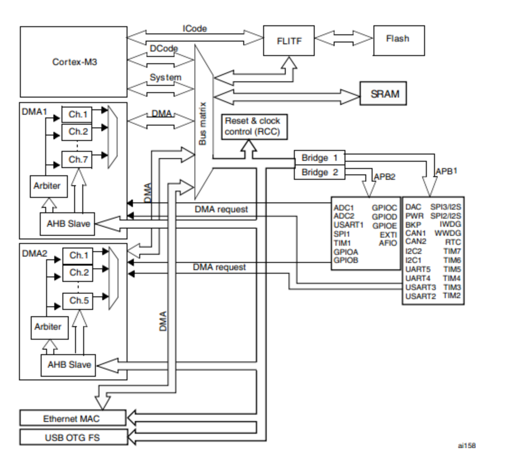
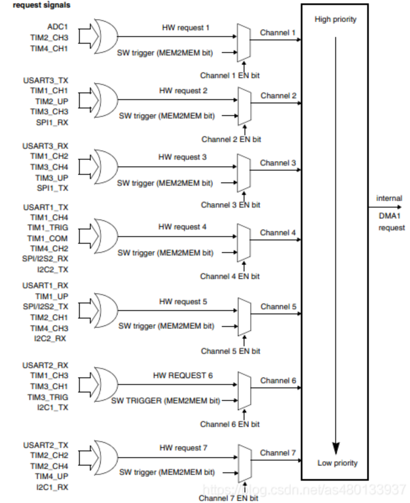
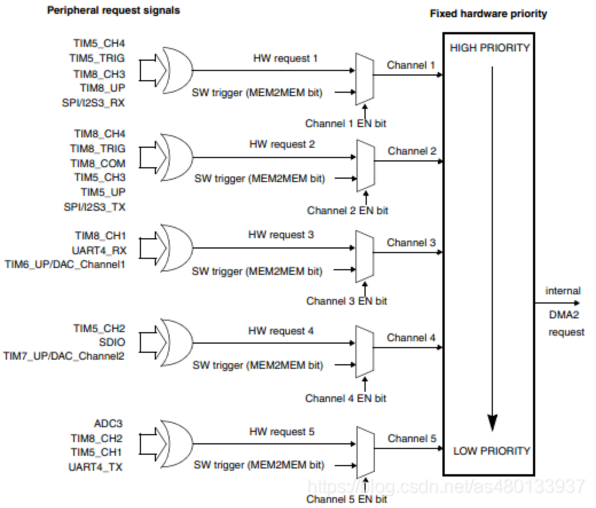
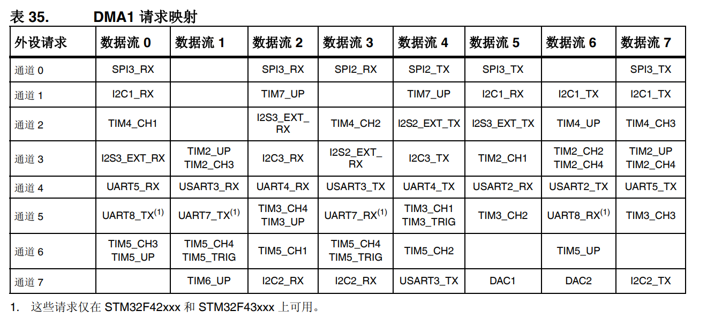
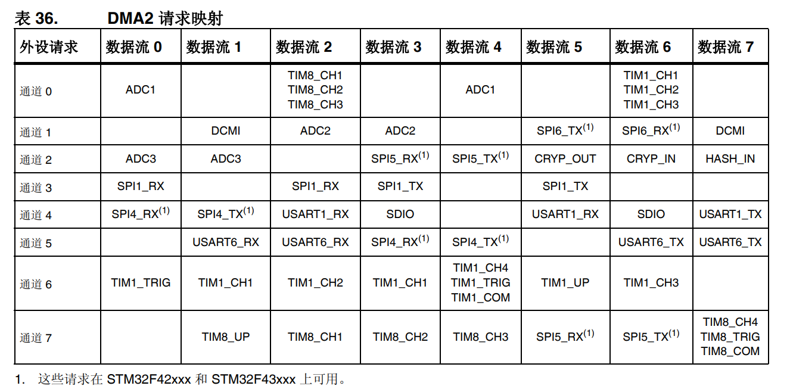

# DMA

## DMA简介

1. **DMA(Direct Memory Access)：直接内存存取**是一种可以大大减轻CPU工作量的数据转移方式。
2. CPU有转移数据、计算、控制程序转移等很多功能，但其实转移数据（尤其是转移大量数据）是可以不需要CPU参与。比如希望外设A的数据拷贝到外设B，**只要给两种外设提供一条数据通路**，再加上一些控制转移的部件就可以完成数据的拷贝。
3. DMA就是基于以上设想设计的，它的作用就是**解决大量数据转移过度消耗CPU资源的问题**。有了DMA使CPU更专注于更加实用的操作--计算、控制等。

## DMA工作原理

DMA的作用就是**实现数据的直接传输，而去掉了传统数据传输需要CPU寄存器参与的环节**，主要涉及四种情况的数据传输，但本质上是一样的，都是从内存的某一区域传输到内存的另一区域（外设的数据寄存器本质上就是内存的一个存储单元）。四种情况的数据传输如下：

- 从内存到外设
- 从外设到内存
- 从内存到内存
- 从外设到外设
  
当用户将参数设置好，主要涉及**源地址、目标地址、传输数据量**这三个，DMA控制器就会启动数据传输，传输的终点就是剩余传输数据量为0（循环传输不是这样的）。换句话说只要剩余传输数据量不是0，而且DMA是启动状态，那么就会发生数据传输。

## DMA结构

1. DMA特性
      - 12个 独立的可配置的通道(请求)**DMA1有7个通道，DMA2 有5个通道**。
      - 每个通道都直接连接专用的硬件DMA请求，每个通道都同样支持软件触发。这些功能通过软件来配置。
      - 在七个请求间的优先权可以通过软件编程设置(**共有四级：很高、高、中等和低**)，假如在相等优先权时由硬件决定(请求0优先于请求1，依此类推)。
      - 独立的源和目标数据区的传输宽度(**字节、半字、全字**)，模拟打包和拆包的过程。源和目标地址必须按数据传输宽度对齐。
      - 每个通道都有3个事件标志(**DMA 半传输，DMA传输完成和DMA传输出错**)，这3个事件标志逻辑或成为一个单独的中断请求。
      - **四种传输方式**。
      - **闪存、SRAM 、外设的SRAM 、APB1 APB2和AHB外设**均可作为访问的源和目标。 
      - 可编程的数据传输数目：最大为**65536**。
2. DMA框图
      
3. DMA通道
      - DMA1
       
      - DMA2
       
4. DMA请求映射
      
      

## DMA CubeMX配置

以USART串口为例


## DMA HAL库函数

1. 初始化函数
   ```C
   // DMA初始化
   HAL_StatusTypeDef HAL_DMA_Init(DMA_HandleTypeDef *hdma)
   ```
2. 操作函数
   ```C
   // DMA接收
   HAL_StatusTypeDef HAL_UART_Receive_DMA(UART_HandleTypeDef *huart, uint8_t *pData, uint16_t Size)   
   // DMA发送
   HAL_StatusTypeDef HAL_UART_Transmit_DMA(UART_HandleTypeDef *huart, const uint8_t *pData, uint16_t Size)  
   // 空闲中断 + DMA
   HAL_StatusTypeDef HAL_UARTEx_ReceiveToIdle_DMA(UART_HandleTypeDef *huart, uint8_t *pData, uint16_t Size)   
   ```
3. 中断回调函数
   ```C
   //函数处理DMA中断请求。
   void HAL_DMA_IRQHandler(DMA_HandleTypeDef *hdma)      
   //Tx传输完成回调函数。             
   void HAL_UART_TxCpltCallback(UART_HandleTypeDef *huart);        
   //Tx半传输完成回调函数。        
   void HAL_UART_TxHalfCpltCallback(UART_HandleTypeDef *huart);      
   //Rx传输完成回调函数。      
   void HAL_UART_RxCpltCallback(UART_HandleTypeDef *huart);                
   //Rx完成一半传输回调函数。
   void HAL_UART_RxHalfCpltCallback(UART_HandleTypeDef *huart);      
   //UART错误回调函数。      
   void HAL_UART_ErrorCallback(UART_HandleTypeDef *huart);           
   //若使能了空闲中断则进入这个函数     
   void HAL_UARTEx_RxEventCallback(UART_HandleTypeDef *huart, uint16_t Size)  
   ```