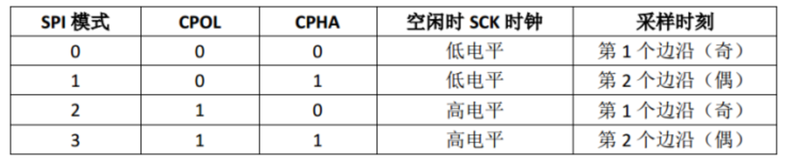

# SPI

## SPI简介
- **SPI**: Serial Peripheral Interface (高速、全双工、同步通信总线)


- **SPI信号线**
    - MISO：主设备输入/从设备输出引脚。该引脚在从模式下发送数据，在主模式下接收数据。
    - MOSI：主设备输出/从设备输入引脚。该引脚在主模式下发送数据，在从模式下接收数据。
    - SCLK：串行时钟信号，由主设备产生。
    - CS/SS：从设备片选信号，由主设备控制。它的功能是用来作为“片选引脚”，也就是选择指定的从设备，让主设备可以单独地与特定从设备通讯，避免数据线上的冲突。

## SPI工作原理

- **SPI结构框图**
    

- **SPI数据发送与接收**
    - 首先拉低对应SS信号线，表示与该设备进行通信
    - 主机通过发送SCLK时钟信号，来告诉从机写数据或者读数据（SCLK时钟信号可能是低电平有效，也可能是高电平有效，因为SPI有四种模式，这个我们在下面会介绍）
    - 主机(Master)将要发送的数据写到发送数据缓存区(Menory)，缓存区经过移位寄存器(0~7)，串行移位寄存器通过MOSI信号线将字节一位一位的移出去传送给从机，，同时MISO接口接收到的数据经过移位寄存器一位一位的移到接收缓存区。
    - 从机(Slave)也将自己的串行移位寄存器(0~7)中的内容通过MISO信号线返回给主机。同时通过MOSI信号线接收主机发送的数据，这样，两个移位寄存器中的内容就被交换。
    

**注意**：SPI只有主模式和从模式之分，没有读和写的说法，外设的写操作和读操作是同步完成的。如果只进行写操作，主机只需忽略接收到的字节；反之，若主机要读取从机的一个字节，就必须发送一个空字节来引发从机的传输。也就是说，你发一个数据必然会收到一个数据；你要收一个数据必须也要先发一个数据。

## SPI工作模式

- 时钟极性（CPOL）
    - CPOL = 0: 低电平空闲，高电平有效
    - CPOL = 1: 高电平空闲，低电平有效
- 时钟相位（CPHA）
    - CPHA = 0: 在时钟的第一个跳变沿（上升沿或下降沿）进行数据采样
    - CPHA = 1: 在时钟的第二个跳变沿（上升沿或下降沿）进行数据采样
- 四种工作模式
    
- 时序图
    

## SPI相关寄存器

- 控制寄存器 (SPI_CR1)
    
- 状态寄存器 (SPI_SR)
    
- 数据寄存器 (SPI_DR)
    
    

## SPI相关HAL库驱动

- SPI初始化
    
- SPI发送接收
    有阻塞、中断、DMA三种模式
    
- SPI回调函数
    ```c
    // 均为弱定义，可重写
    void HAL_SPI_TxCpltCallback(SPI_HandleTypeDef *hspi);
    void HAL_SPI_RxCpltCallback(SPI_HandleTypeDef *hspi);
    void HAL_SPI_TxRxCpltCallback(SPI_HandleTypeDef *hspi);
    ```
