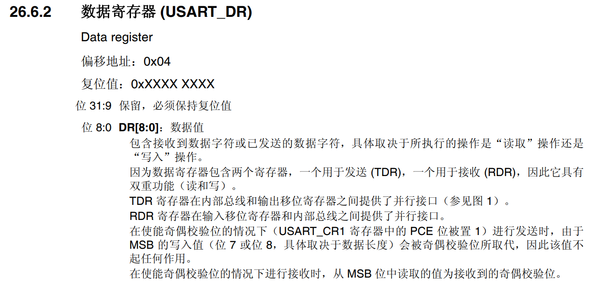
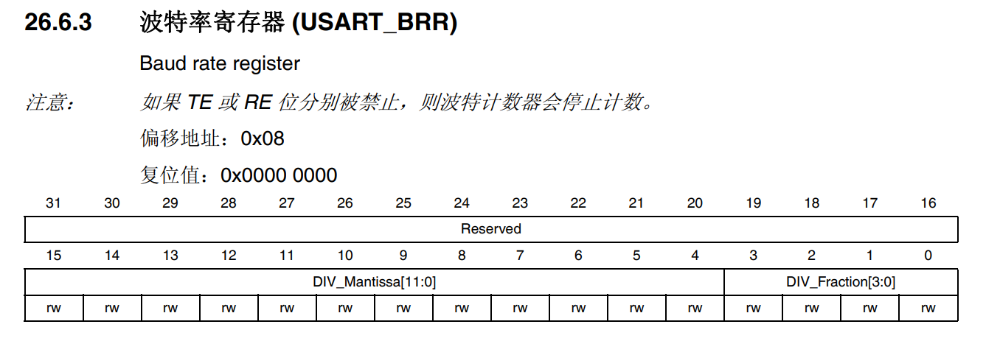
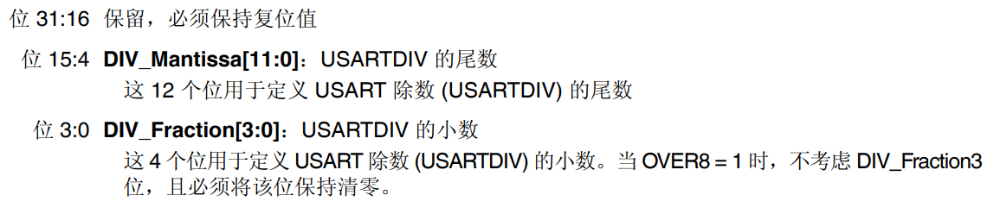

# USART

## USART简介

嵌入式开发中，USART串口通信协议是我们常用的通信协议（USART、I2C、SPI等）之一，全称叫做通用同步/异步收发传输器（Universal Synchronous Asynchronous Receiver/Transmitter），工作原理是将传输数据的每个字符一位接一位地传输，能够灵活地与外部设备进行全双工数据交换。

## USART通信协议


1. 开始位
   
      当未有数据发送时，数据线处于逻辑“1”状态；先发出一个逻辑“0”信号，表示开始传输字符。

2. 数据位
   
      起始位后接着跟随的8位或9位数据位，从最低位开始传送（低位先行）。

3. 奇偶校验位
   
      加上这一位后，使得“1”的位数应为偶数（偶校验）或奇数（奇校验），以此来校验资料传送的正确性。

4. 停止位
   
      以一个先高后低的脉冲表示结束位，长度可以设置为 0.5，1，1.5 或 2 位长度。

5. 波特率
   
      表示每秒钟传送的码元符号的个数，是衡量数据传送速率的指标，常用的波特率有：9600、38400、115200。

6. 空闲帧
   
      处于逻辑“1”状态，表示当前线路上没有资料传送，进入空闲状态。

## USART工作原理

1. USART框图
   
      

2. 功能引脚
   
      接收数据**输入引脚 (RX)** 和发送数据**输出引脚 (TX)**。

3. 寄存器
   
      - 数据寄存器（DR）
         
      - 状态寄存器（SR）
         
      - 控制寄存器（CR）
         
         
      - 波特率寄存器（BRR）
         
         
         

## CubeMx配置


**注意发送方和接收方的配置保持一致！！！**

## HAL库常用函数

1. 初始化函数
   
      ```C
      HAL_StatusTypeDef HAL_UART_Init(UART_HandleTypeDef *huart);
      void HAL_UART_MspInit(UART_HandleTypeDef* uartHandle);
      ```

2. 操作函数
   
      ```C
      //以阻塞模式发送数据。
      HAL_StatusTypeDef HAL_UART_Transmit(UART_HandleTypeDef *huart, uint8_t *pData, uint16_t Size, uint32_t Timeout);     
      //在阻塞模式下接收数据。
      HAL_StatusTypeDef HAL_UART_Receive(UART_HandleTypeDef *huart, uint8_t *pData, uint16_t Size, uint32_t Timeout);     
      //以中断模式发送数据。
      HAL_StatusTypeDef HAL_UART_Transmit_IT(UART_HandleTypeDef *huart, uint8_t *pData, uint16_t Size);              
      //在中断模式下接收数据。
      HAL_StatusTypeDef HAL_UART_Receive_IT(UART_HandleTypeDef *huart, uint8_t *pData, uint16_t Size);              
      //以DMA模式发送大量数据。
      HAL_StatusTypeDef HAL_UART_Transmit_DMA(UART_HandleTypeDef *huart, uint8_t *pData, uint16_t Size);               
      //在DMA模式下接收大量数据。
      HAL_StatusTypeDef HAL_UART_Receive_DMA(UART_HandleTypeDef *huart, uint8_t *pData, uint16_t Size);              
      //接收空闲中断接收数据
      HAL_StatusTypeDef HAL_UARTEx_ReceiveToIdle_IT(UART_HandleTypeDef *huart, uint8_t *pData, uint16_t Size)       
      //接收空闲中断+DMA
      HAL_StatusTypeDef HAL_UARTEx_ReceiveToIdle_DMA(UART_HandleTypeDef *huart, uint8_t *pData, uint16_t Size)
      ```

3. 中断处理及回调函数
   
      ```C
      //函数处理UART中断请求。
      void HAL_UART_IRQHandler(UART_HandleTypeDef *huart);                  
      //Tx传输完成回调函数。
      void HAL_UART_TxCpltCallback(UART_HandleTypeDef *huart);               
      //Tx半传输完成回调函数。
      void HAL_UART_TxHalfCpltCallback(UART_HandleTypeDef *huart);            
      //Rx传输完成回调函数。
      void HAL_UART_RxCpltCallback(UART_HandleTypeDef *huart);            
      //Rx完成一半传输回调函数。    
      void HAL_UART_RxHalfCpltCallback(UART_HandleTypeDef *huart);            
      //UART错误回调函数。
      void HAL_UART_ErrorCallback(UART_HandleTypeDef *huart);            
      //空闲中断回调函数。    
      void HAL_UARTEx_RxEventCallback(UART_HandleTypeDef *huart, uint16_t Size)  
      ```