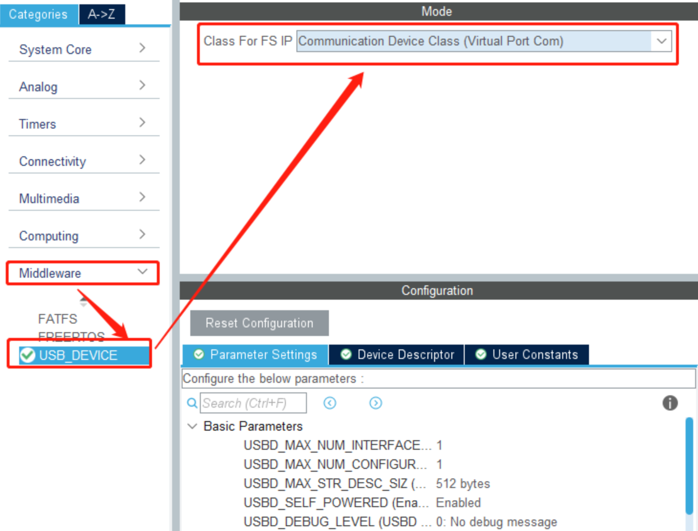

# USB

## USB简介

1. USB (Universal Serial Bus) 即通用串行总线。
   
2. USB 是一种主从结构系统，数据交换只能发生在主从设备之间，且只能由主机发起。
   
3. 标准 USB 共四根线组成, 除 VCC / GND 外, 另外为 D+、D-, 这两根数据线采用的是差分电压的方式进行数据传输。在 USB 主机上，D-和 D+都是接了 15K 的电阻到 GND，所以在没有设备接入的时候，D+、D-均是低电平。而在 USB 设备中，如果是高速设备，则会在 D+上接一个 1.5K 的电阻到 VCC；而如果是低速设备，则会在 D-上接一个 1.5K 的电阻到 VCC。这样当设备接入主机的时候，主机就可以判断是否有设备接入，并能判断设备是高速设备还是低速设备。
   
    

    


## STM32 USB框图


## STM32CUBEMX 配置 （CDC虚拟串口）

1. USB 参数配置
   
    

    选择 **USB_OTG_FS**(全速模式 12MBits/s)，模式选择**Device_Only**(从设备)，其他保持默认即可。

2. USB Device
   
    在 Middleware 中选择 USB_DEVICE 设置，在 Class For FS IP 设备类别选择 **Communication Device Class（Virtual Port Com）** 虚拟串口。

    

    参数配置、设备标识符保持默认即可。

    
    

3. 查看端口
   
    烧录默认代码，连上电脑可看到对应端口。
    


## USB虚拟串口函数驱动

```C
// USB初始化
void MX_USB_DEVICE_Init(void)
{
  USBD_Init(&hUsbDeviceFS, &FS_Desc, DEVICE_FS);
 
  USBD_RegisterClass(&hUsbDeviceFS, &USBD_CDC);
 
  // 重点关注这个函数，此函数是连接 USB_Device 和 CDC_Interface_callback 之间的桥梁
  USBD_CDC_RegisterInterface(&hUsbDeviceFS, &USBD_Interface_fops_FS);
 
  USBD_Start(&hUsbDeviceFS);
}


// 函数功能是将 USBD_HandleTypeDef 类型的结构体 pdev 的成员 pUserData 赋值为USBD_CDC_ItfTypeDef 类型的结构体 fops
uint8_t USBD_CDC_RegisterInterface(USBD_HandleTypeDef *pdev,
                                   USBD_CDC_ItfTypeDef *fops)
{
  if (fops == NULL)
  {
    return (uint8_t)USBD_FAIL;
  }

  pdev->pUserData[pdev->classId] = fops;

  return (uint8_t)USBD_OK;
}


// USBD_CDC_ItfTypeDef 结构体成员，其中包含用户需定义或修改的函数指针
typedef struct _USBD_CDC_Itf
{
  int8_t (* Init)(void);
  int8_t (* DeInit)(void);
  int8_t (* Control)(uint8_t cmd, uint8_t *pbuf, uint16_t length);
  int8_t (* Receive)(uint8_t *Buf, uint32_t *Len);
  int8_t (* TransmitCplt)(uint8_t *Buf, uint32_t *Len, uint8_t epnum);
} USBD_CDC_ItfTypeDef;


// ST 预留函数接口，用户只需要修改USBD_Interface_fops_FS中的四个函数
USBD_CDC_ItfTypeDef USBD_Interface_fops_FS = 
{
  CDC_Init_FS,
  CDC_DeInit_FS,
  CDC_Control_FS,  
  CDC_Receive_FS
};
```

```C
// 下面具体介绍 USBD_Interface_fops_FS 中的四个函数

// 初始化函数，设置收发缓冲区
static int8_t CDC_Init_FS(void)
{
  /* USER CODE BEGIN 3 */
  /* Set Application Buffers */
  USBD_CDC_SetTxBuffer(&hUsbDeviceFS, UserTxBufferFS, 0);
  USBD_CDC_SetRxBuffer(&hUsbDeviceFS, UserRxBufferFS);
  return (USBD_OK);
  /* USER CODE END 3 */
}


// CDC控制命令处理，具体处理过程需要用户自己编写。
// 其中包括串口参数的设置，要做串口转USB通信的话需要修改这里，只是为了用USB与PC通信则不用管这里。每个命令具体的意思需要查询CDC类手册。
static int8_t CDC_Control_FS(uint8_t cmd, uint8_t* pbuf, uint16_t length);


// 虚拟串口发送，发送时可直接调用
uint8_t CDC_Transmit_FS(uint8_t* Buf, uint16_t Len);


// 虚拟串口接收
// USB接收回调函数，在USB VPC接收到数据时，会进入该函数，在该函数中进行USB数据接收处理或进行函数回调即可。
static int8_t CDC_Receive_FS(uint8_t* Buf, uint32_t *Len);
```