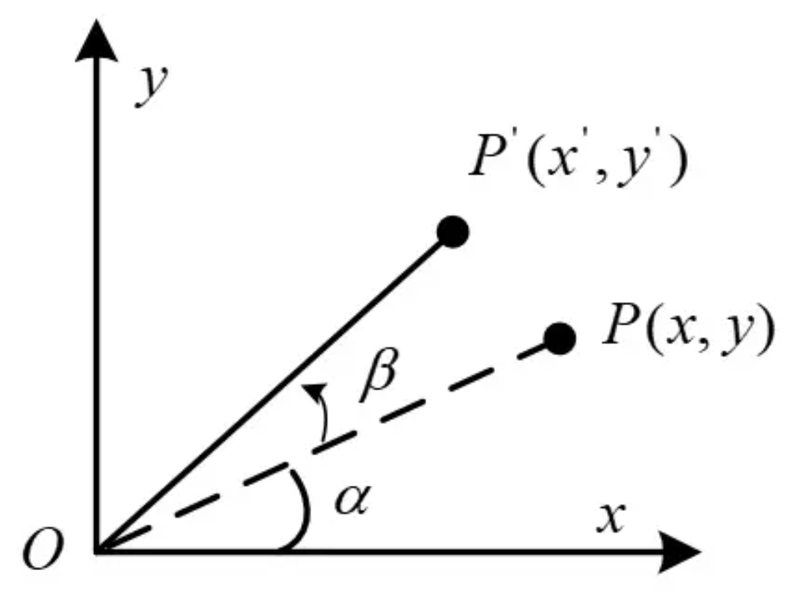
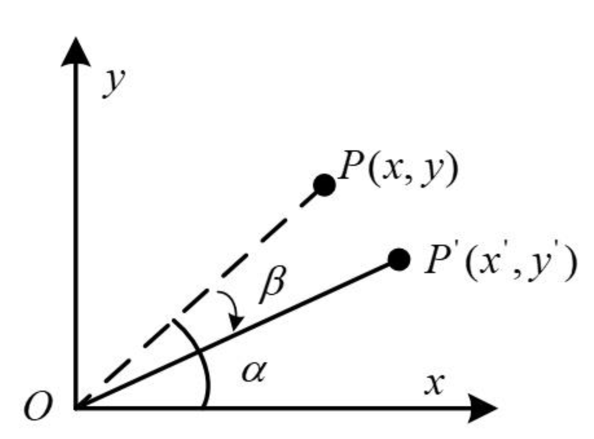
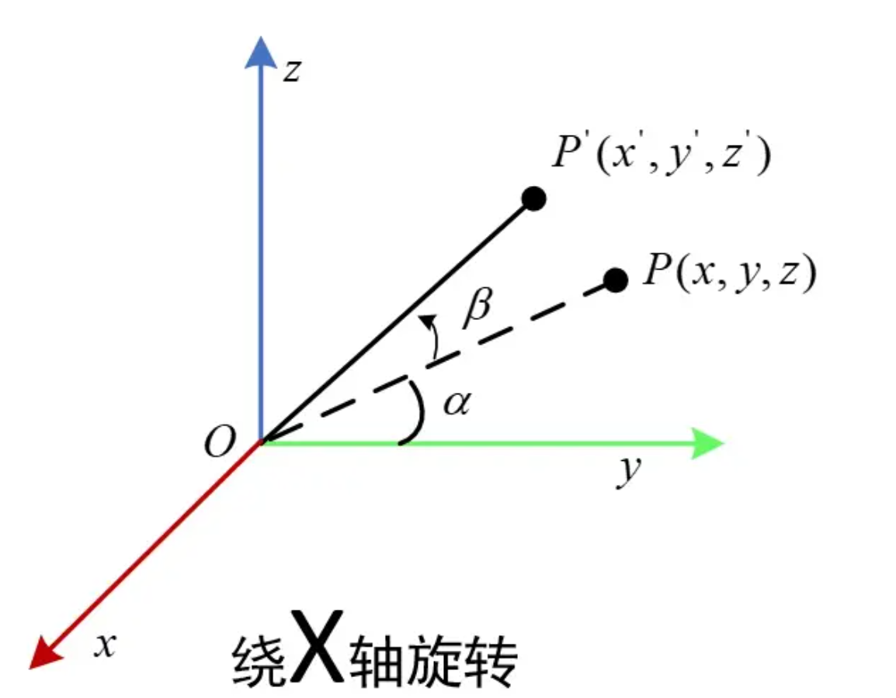
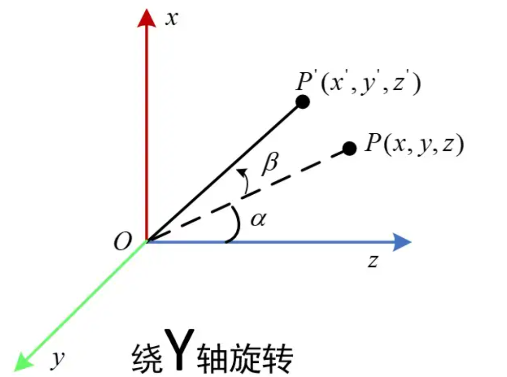
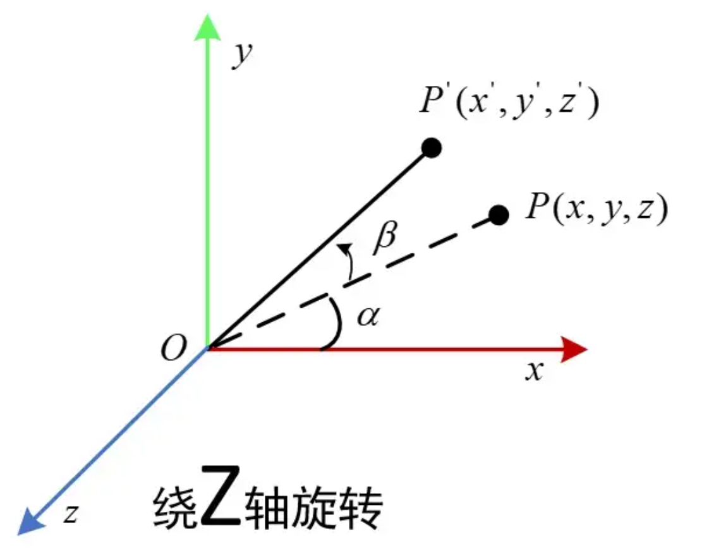
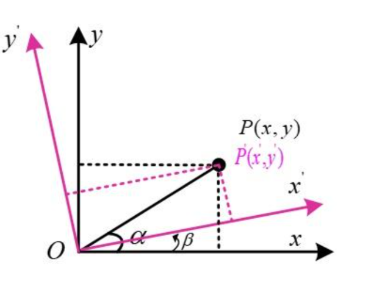
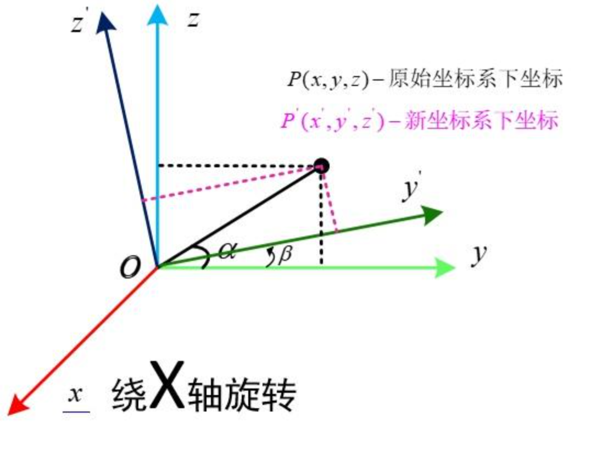
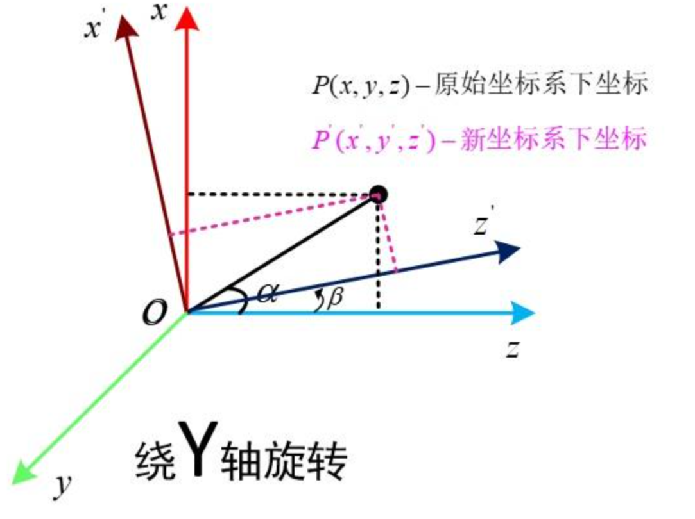
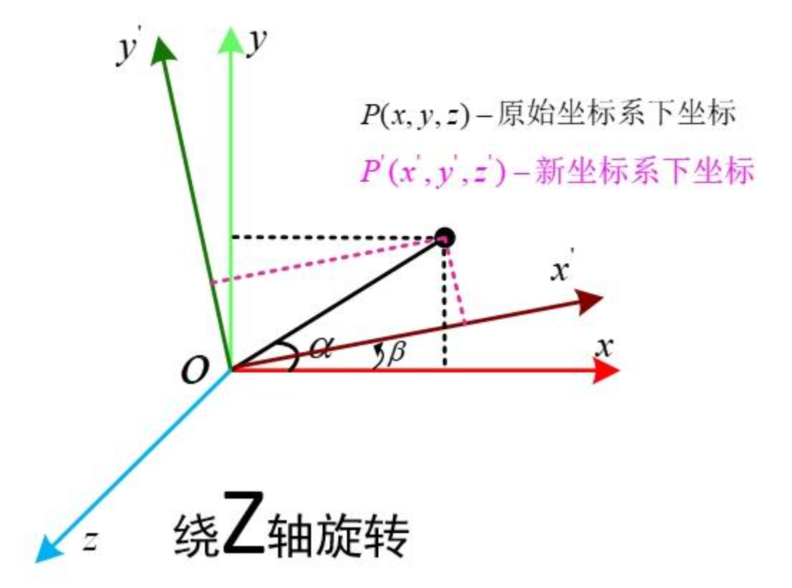
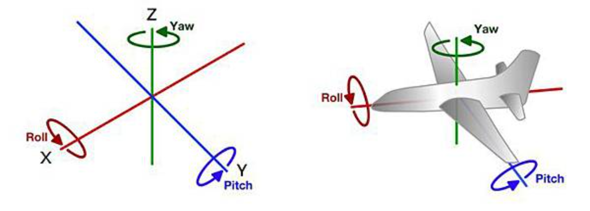

# 三维旋转表示

## 旋转矩阵

旋转矩阵包含两种意思：一是在固定坐标系下，向量的旋转；二是坐标系旋转，使得同一向量在不同坐标系下表示不同。

接下来首先讨论二维平面旋转表示，然后引申至三维。

### 向量旋转（外旋）

- 二维平面旋转
    { width="400" style="display:block;margin:auto;" }

    $$
    \begin{equation*}
    \left\{
    \begin{aligned}
    x'={|OP|}\cdot{\cos(\alpha+\beta)}={|OP|}\cdot{(\cos\alpha\cos\beta-\sin\alpha\sin\beta)}={x}\cdot{\cos\beta}-{y}\cdot{\sin\beta}   \\
    y'={|OP|}\cdot{\sin(\alpha+\beta)}={|OP|}\cdot{(\sin\alpha\cos\beta+\cos\alpha\sin\beta)}={x}\cdot{\sin\beta}+{y}\cdot{\cos\beta}
    \end{aligned}
    \right.
    \end{equation*}
    $$

    转换成矩阵形式：

    $$
    \begin{bmatrix}
    x'\\
    y'
    \end{bmatrix}=
    {\begin{bmatrix}
    \cos\beta&-\sin\beta\\
    \sin\beta&\cos\beta
    \end{bmatrix}}\cdot
    {\begin{bmatrix}
    x\\
    y
    \end{bmatrix}}
    $$

    中间的矩阵为二维旋转矩阵，向量左乘该矩阵即为该向量逆时针旋转$\beta$角之后得到的向量。

    反向（顺时针）旋转：
    { width="400" style="display:block;margin:auto;" }

    $$
    \begin{bmatrix}
    x'\\
    y'
    \end{bmatrix}=
    {\begin{bmatrix}
    \cos\beta&\sin\beta\\
    -\sin\beta&\cos\beta
    \end{bmatrix}}\cdot
    {\begin{bmatrix}
    x\\
    y
    \end{bmatrix}}
    $$

    注意到，该矩阵为正向旋转矩阵的逆矩阵，且为转置矩阵（因为旋转矩阵为正交矩阵）。

- 三维旋转
  
    为简化分析与计算，下面只考虑绕X、Y、Z轴的旋转。
    
    - 绕X轴
        { width="400" style="display:block;margin:auto;" }

        $$
        \begin{equation*}
        \left\{
        \begin{aligned}
        &x' = x  \\
        &y'={|OP|}\cdot{\cos(\alpha+\beta)}={|OP|}\cdot{(\cos\alpha\cos\beta-\sin\alpha\sin\beta)}={y}\cdot{\cos\beta}-{z}\cdot{\sin\beta}   \\
        &z'={|OP|}\cdot{\sin(\alpha+\beta)}={|OP|}\cdot{(\sin\alpha\cos\beta+\cos\alpha\sin\beta)}={y}\cdot{\sin\beta}+{z}\cdot{\cos\beta}
        \end{aligned}
        \right.
        \end{equation*}
        $$

        $$
        \begin{bmatrix}
        x'\\
        y'\\
        z'
        \end{bmatrix}=
        {\begin{bmatrix}
        1&0&0\\
        0&\cos\beta&-\sin\beta\\
        0&\sin\beta&\cos\beta
        \end{bmatrix}}\cdot
        {\begin{bmatrix}
        x\\
        y\\
        z
        \end{bmatrix}}
        $$

    - 绕Y轴
        { width="400" style="display:block;margin:auto;" }

        $$
        \begin{equation*}
        \left\{
        \begin{aligned}
        &x'={|OP|}\cdot{\sin(\alpha+\beta)}={|OP|}\cdot{(\sin\alpha\cos\beta+\cos\alpha\sin\beta)}={x}\cdot{\cos\beta}+{z}\cdot{\sin\beta}    \\
        &y'=y   \\
        &z'={|OP|}\cdot{\cos(\alpha+\beta)}={|OP|}\cdot{(\cos\alpha\cos\beta-\sin\alpha\sin\beta)}={x}\cdot{(-\sin\beta)}+{z}\cdot{\cos\beta}
        \end{aligned}
        \right.
        \end{equation*}
        $$

        $$
        \begin{bmatrix}
        x'\\
        y'\\
        z'
        \end{bmatrix}=
        {\begin{bmatrix}
        \cos\beta&0&\sin\beta\\
        0&1&0\\
        -\sin\beta&0&\cos\beta
        \end{bmatrix}}\cdot
        {\begin{bmatrix}
        x\\
        y\\
        z
        \end{bmatrix}}
        $$

    - 绕Z轴
        { width="400" style="display:block;margin:auto;" }

        $$
        \begin{equation*}
        \left\{
        \begin{aligned}
        &x'={|OP|}\cdot{\cos(\alpha+\beta)}={|OP|}\cdot{(\cos\alpha\cos\beta-\sin\alpha\sin\beta)}={x}\cdot{\cos\beta}-{y}\cdot{\sin\beta}   \\
        &y'={|OP|}\cdot{\sin(\alpha+\beta)}={|OP|}\cdot{(\sin\alpha\cos\beta+\cos\alpha\sin\beta)}={x}\cdot{\sin\beta}+{y}\cdot{\cos\beta}   \\
        &z'=z
        \end{aligned}
        \right.
        \end{equation*}
        $$

        $$
        \begin{bmatrix}
        x'\\
        y'\\
        z'
        \end{bmatrix}=
        {\begin{bmatrix}
        \cos\beta&-\sin\beta&0\\
        \sin\beta&\cos\beta&0\\
        0&0&1
        \end{bmatrix}}\cdot
        {\begin{bmatrix}
        x\\
        y\\
        z
        \end{bmatrix}}
        $$

    - 三维旋转矩阵

        以上旋转矩阵都是在右手坐标系下计算的，三维旋转矩阵就由以上三个矩阵依次左乘得到，且逆时针为正，三维旋转矩阵表示为：

        $$
        M=
        {R_x(\alpha)}\cdot{R_y(\beta)}\cdot{R_z(\gamma)}=
        {\begin{bmatrix}
        1&0&0\\
        0&\cos\alpha&-\sin\alpha\\
        0&\sin\alpha&\cos\alpha
        \end{bmatrix}}\cdot
        {\begin{bmatrix}
        \cos\beta&0&\sin\beta\\
        0&1&0\\
        -\sin\beta&0&\cos\beta
        \end{bmatrix}}\cdot
        {\begin{bmatrix}
        \cos\gamma&-\sin\gamma&0\\
        \sin\gamma&\cos\gamma&0\\
        0&0&1
        \end{bmatrix}}=
        {\begin{bmatrix}
        \cos\beta\cos\gamma&-\cos\beta\sin\gamma&\sin\beta\\
        \cos\alpha\sin\gamma+\cos\gamma\sin\alpha\sin\beta&\cos\alpha\cos\gamma-\sin\alpha\sin\beta\sin\gamma&-\cos\beta\sin\alpha\\
        \sin\alpha\sin\gamma-\cos\alpha\cos\gamma\sin\beta&\cos\gamma\sin\alpha+\cos\alpha\sin\beta\sin\gamma&\cos\alpha\cos\beta
        \end{bmatrix}}
        $$

        上述表示向量先绕Z轴旋转$\gamma$角，再绕Y轴旋转$\beta$角，最后绕X轴旋转$\alpha$角的旋转矩阵。

### 坐标系旋转（内旋）

- 二维平面旋转
    { width="400" style="display:block;margin:auto;" }

    矩阵表示为：

    $$
    \begin{bmatrix}
    x \\ y
    \end{bmatrix}=
    {\begin{bmatrix}
    \cos\beta&-\sin\beta\\
    \sin\beta&\cos\beta
    \end{bmatrix}}\cdot
    {\begin{bmatrix}
    x' \\ y'
    \end{bmatrix}}
    $$

- 三维旋转
  
    - 绕X轴
        { width="400" style="display:block;margin:auto;" }

        $$
        \begin{bmatrix}
        x \\ y \\ z
        \end{bmatrix}=
        {\begin{bmatrix}
        1&0&0\\
        0&\cos\beta&-\sin\beta\\
        0&\sin\beta&\cos\beta
        \end{bmatrix}}\cdot
        {\begin{bmatrix}
        x' \\ y' \\ z'
        \end{bmatrix}}
        $$

    - 绕Y轴
        { width="400" style="display:block;margin:auto;" }

        $$
        \begin{bmatrix}
        x \\ y \\ z
        \end{bmatrix}=
        {\begin{bmatrix}
        \cos\beta&0&\sin\beta\\
        0&1&0\\
        -\sin\beta&0&\cos\beta
        \end{bmatrix}}\cdot
        {\begin{bmatrix}
        x' \\ y' \\ z'
        \end{bmatrix}}
        $$

    - 绕Z轴
        { width="400" style="display:block;margin:auto;" }

        $$
        \begin{bmatrix}
        x \\ y \\ z
        \end{bmatrix}=
        {\begin{bmatrix}
        \cos\beta&-\sin\beta&0\\
        \sin\beta&\cos\beta&0\\
        0&0&1
        \end{bmatrix}}\cdot
        {\begin{bmatrix}
        x' \\ y' \\ z'
        \end{bmatrix}}\cdot
        $$

    - 三维旋转矩阵

        以上旋转矩阵都是在右手坐标系下计算的，三维旋转矩阵就由以上三个矩阵依次右乘得到，且逆时针为正，三维旋转矩阵表示为：

        $$
        M=
        {R_x(\alpha)}\cdot{R_y(\beta)}\cdot{R_z(\gamma)}=
        {\begin{bmatrix}
        1&0&0\\
        0&\cos\alpha&-\sin\alpha\\
        0&\sin\alpha&\cos\alpha
        \end{bmatrix}}\cdot
        {\begin{bmatrix}
        \cos\beta&0&\sin\beta\\
        0&1&0\\
        -\sin\beta&0&\cos\beta
        \end{bmatrix}}\cdot
        {\begin{bmatrix}
        \cos\gamma&-\sin\gamma&0\\
        \sin\gamma&\cos\gamma&0\\
        0&0&1
        \end{bmatrix}}=
        {\begin{bmatrix}
        \cos\beta\cos\gamma&-\cos\beta\sin\gamma&\sin\beta\\
        \cos\alpha\sin\gamma+\cos\gamma\sin\alpha\sin\beta&\cos\alpha\cos\gamma-\sin\alpha\sin\beta\sin\gamma&-\cos\beta\sin\alpha\\
        \sin\alpha\sin\gamma-\cos\alpha\cos\gamma\sin\beta&\cos\gamma\sin\alpha+\cos\alpha\sin\beta\sin\gamma&\cos\alpha\cos\beta
        \end{bmatrix}}
        $$

        上述表示坐标系先绕X轴旋转$\alpha$角，再绕Y轴旋转$\beta$角，最后绕Z轴旋转$\gamma$角的旋转矩阵。

### 总结

- 外旋：绕固定坐标系旋转，左乘，坐标（向量）在变换。
- 内旋：绕自身坐标系旋转，右乘，坐标系（基底）在变换。
- Z-Y-X顺序的外旋等价于X-Y-Z顺序的内旋。

## 欧拉角

欧拉角（Euler Angles）一般指绕物体自身坐标系的旋转，而绕固定坐标系的旋转，我们一般称之为固定角（Fixed Angles）

### 直观表示
以X、Y、Z轴旋转的角度表示三维空间的旋转，也就是Row、Pitch、Yaw的角度：

### 表达方式

欧拉角一般具有两大类表达方式，每类按照旋转次序的不同分为6小类:

Proper Euler angles (z-x-z, x-y-x, y-z-y, z-y-z, x-z-x, y-x-y)

Tait–Bryan angles (x-y-z, y-z-x, z-x-y, x-z-y, z-y-x, y-x-z)

每个大类都使用了3个变量描述三次旋转过程中的旋转角度，差别在于Proper Euler angles只涉及两个转轴，而Tait–Bryan angles涉及三个转轴。

如果只给出一组欧拉角，绕x，y，z轴的转角为$(\alpha, \beta, \gamma)$，我们并不能确定其姿态，还需要知道旋转顺序，才能确定这组欧拉角对应的姿态。

### 万向节死锁

万向锁（Gimbal Lock），当 $Pitch = ±90°$ 时，绕第三个轴旋转的欧拉角和绕第一个轴旋转的欧拉角效果相同，即系统失去了一个自由度，出现了奇异性。

这里给出万向锁的直观表示：[无伤理解欧拉角中的“万向死锁”现象](https://www.bilibili.com/video/BV1Nr4y1j7kn/?share_source=copy_web&vd_source=938cb8d67256b079713f07708c708374)

在使用欧拉角表示时，保证$Pitch\neq±90°$，避免出现万向锁的问题。

## 四元数

四元数的直观表示比较复杂，难以理解，但四元数在三维旋转表示中有着独特的优势。相较于欧拉角，可避免万向锁的问题；相较于旋转矩阵，又可清晰地表示出旋转轴及旋转角度，这里给出[四元数可视化](https://www.bilibili.com/video/BV1SW411y7W1?from=search&seid=2286694305504614618&spm_id_from=333.337.0.0)。

### 定义

四元数是由实数加上三个元素 $i, j, k$ 组成，而且它们有如下的关系：

$$
i^2+j^2+k^2=ijk=-1
$$

四元数一般表示为 $a+bi+cj+dk$

四元数也可表示为向量形式：

$$
q=
{\begin{bmatrix}
a\\
b\\
c\\
d
\end{bmatrix}
}
$$

此外，我们在表示四元数时，还经常把实部与虚部分开，用一个实数 $s$ 表示实部，用一个三维向量 $\vec{v}$ 来表示虚部：

$$
q=
{\begin{bmatrix}
s&\vec{v}
\end{bmatrix}
}，
(\vec{v}=
{\begin{bmatrix}
x\\
y\\
z
\end{bmatrix}
}，
s,x,y,z\in{R})
$$

### 基本性质

四元数乘法满足反交换律：

$$
ij=k，ji=-k;  
$$

$$
jk=i，kj=-i;  
$$

$$
ki=j，ik=-j;
$$

四元数模长（范数）：

$$
||q||=\sqrt{a^2+b^2+c^2+d^2}
$$

或者

$$
||q||=\sqrt{s^2+||v||^2}
$$

四元数共轭：

$$
q^*=a-bi-cj-dk
$$

四元数的逆：

$$
{q^{-1}}\cdot{q}=1
$$

$$
q^{-1}={{q^*}\over{||q||^2}}
$$

纯四元数（仅有虚部）：

$$
q=
{\begin{bmatrix}
0&\vec{v}
\end{bmatrix}
}
$$

单位四元数（模长为1）：

$$
||q||=1
$$

### 单位四元数表示三维空间旋转

若三维空间里的一个点的笛卡尔坐标为 $(x,y,z)$，则它用纯四元数 $xi+yj+zk$ 表示。

设 $q$ 为一个单位四元数，而 $p$ 是一个纯四元数，定义：

$$
R_q(p)=qpq^{-1}
$$

则 $R_q(p)$ 也是一个纯四元数，可以证明 $R_q$ 确实表示一个旋转，这个旋转将空间的点 $p$ 旋转为空间的另一个点 $R_q(p)$。

其中：

$$
q=
{\begin{bmatrix}
\cos{\theta\over2}&\vec{v}\cdot\sin{\theta\over2}
\end{bmatrix}
}
$$

$\vec{v}={\begin{bmatrix}x\\y\\z\end{bmatrix}}$ 为三维旋转轴向量，$\theta$ 为旋转角度（这实际上就是三维旋转的又一种表示方法：轴角表示）。

## 三者关系

### 旋转矩阵与欧拉角

- 欧拉角转旋转矩阵

    已知一组欧拉角，绕自身坐标系Z-Y-X旋转$(\gamma, \beta, \alpha)$，则旋转矩阵为：

    $$
    M=
    {R_z(\gamma)}\cdot{R_y(\beta)}\cdot{R_x(\alpha)}=
    {\begin{bmatrix}
    \cos(\beta)\cos(\gamma)&\cos(\gamma)\sin(\alpha)\sin(\beta) - \cos(\alpha)\sin(\gamma)&\sin(\alpha)\sin(\gamma) + \cos(\alpha)\cos(\gamma)\sin(\beta)\\
    \cos(\beta)\sin(\gamma)&\cos(\alpha)\cos(\gamma) + \sin(\alpha)\sin(\beta)\sin(\gamma)&\cos(\alpha)\sin(\beta)\sin(\gamma) - \cos(\gamma)\sin(\alpha)\\
    -\sin(\beta)&\cos(\beta)\sin(\alpha)&\cos(\alpha)\cos(\beta)
    \end{bmatrix}
    }
    $$

- 旋转矩阵转欧拉角

    已知旋转矩阵：

    $$
    R=
    {\begin{bmatrix}
    r_{11}&r_{12}&r_{13}\\
    r_{21}&r_{22}&r_{23}\\
    r_{31}&r_{32}&r_{33}
    \end{bmatrix}
    }
    $$

    求出各轴旋转角为：

    $$
    \begin{equation*}
    \left\{
    \begin{aligned}
    &\gamma=atan2(r_{21}, r_{11}) \\
    &\beta=atan2(-r_{31}, \sqrt{r_{32}^2+r_{33}^2}) \\
    &\alpha=atan2(r_{32}, r_{33})
    \end{aligned}
    \right.
    \end{equation*}
    $$

    注意旋转顺序是是绕自身坐标系Z-Y-X旋转。

### 四元数与旋转矩阵

下面均在固定坐标系（右手系）下讨论旋转。

- 四元数转旋转矩阵
  
    已知旋转轴向量为 $\vec{v}={\begin{bmatrix}n_x\\n_y\\n_z\end{bmatrix}}$（单位向量），旋转角度为 $\theta$ ，则绕该轴旋转的旋转矩阵为：

    $$
    R(n, \theta)=
    {\begin{bmatrix}
    (1-\cos\theta)n_x^2+\cos\theta&(1-\cos\theta)n_xn_y-n_z\sin\theta&(1-\cos\theta)n_xn_z+n_y\sin\theta\\
    (1-\cos\theta)n_xn_y+n_z\sin\theta&(1-\cos\theta)n_y^2+\cos\theta&(1-\cos\theta)n_yn_z-n_x\sin\theta\\
    (1-\cos\theta)n_xn_z-n_y\sin\theta&(1-\cos\theta)n_yn_z+n_x\sin\theta&(1-\cos\theta)n_z^2+\cos\theta
    \end{bmatrix}
    }
    $$

    具体推导过程参考：[绕空间任意轴的旋转矩阵推导](https://blog.csdn.net/u014265928/article/details/117170481)

    已知 $q_0=\cos{\theta\over2}，q_1=n_x\sin{\theta\over2}，q_2=n_y\sin{\theta\over2}，q_3=n_z\sin{\theta\over2}$ ，根据上式则可推导出四元数对应的旋转矩阵为：

    $$
    R=
    {\begin{bmatrix}
    1-2q_2^2-2q_3^2&2q_1q_2-2q_0q_3&2q_1q_3+2q_0q_2\\
    2q_1q_2+2q_0q_3&1-2q_1^2-2q_3^2&2q_2q_3-2q_0q_1\\
    2q_1q_3-2q_0q_2&2q_2q_3+2q_0q_1&1-2q_1^2-2q_2^2
    \end{bmatrix}}
    $$

- 旋转矩阵转四元数

    已知旋转矩阵：

    $$
    R=
    {\begin{bmatrix}
    r_{11}&r_{12}&r_{13}\\
    r_{21}&r_{22}&r_{23}\\
    r_{31}&r_{32}&r_{33}
    \end{bmatrix}
    }
    $$

    注意到：

    $$
    tr(R)=r_{11}+r_{22}+r_{33}=4q_0^2-1
    $$

    则可推导出：

    $$
    \begin{equation*}
    \left\{
    \begin{aligned}
    &q_0={\sqrt{tr(R)+1}\over2}\\
    &q_1={{r_{32}-r_{23}}\over4q_0}\\
    &q_2={{r_{13}-r_{31}}\over4q_0}\\
    &q_3={{r_{21}-r_{12}}\over4q_0}
    \end{aligned}
    \right.
    \end{equation*}
    $$

    这里只给出了其中一种解法，上面四个公式涉及开方一个数以及除以该数，由于数值计算精度问题或噪声问题，该数会出现负数的情况；有时候这个数会非常小，除以一个非常小的数会有精度问题。这里给出其他解法以及选择合适公式的参考：[单位四元数和旋转矩阵互相转换](https://zhuanlan.zhihu.com/p/635847061)

### 四元数与欧拉角

这里给出四元数与欧拉角相互转换的可视化网站：[Quaternions](https://quaternions.online/)

- 欧拉角转四元数

    已知一组欧拉角，绕自身坐标系Z-Y-X旋转$(\gamma, \beta, \alpha)$，则四元数为：

    $$
    q=
    {\begin{bmatrix}
    \cos{\gamma\over2}\\
    0\\
    0\\
    \sin{\gamma\over2}
    \end{bmatrix}}\cdot
    {\begin{bmatrix}
    \cos{\beta\over2}\\
    0\\
    \sin{\beta\over2}\\
    0
    \end{bmatrix}}\cdot
    {\begin{bmatrix}
    \cos{\alpha\over2}\\
    \sin{\alpha\over2}\\
    0\\
    0
    \end{bmatrix}}=
    {\begin{bmatrix}
    \cos{\alpha\over2}\cos{\beta\over2}\cos{\gamma\over2}+\sin{\alpha\over2}\sin{\beta\over2}\sin{\gamma\over2}\\
    \sin{\alpha\over2}\cos{\beta\over2}\cos{\gamma\over2}-\cos{\alpha\over2}\sin{\beta\over2}\sin{\gamma\over2}\\
    \cos{\alpha\over2}\sin{\beta\over2}\cos{\gamma\over2}+\sin{\alpha\over2}\cos{\beta\over2}\sin{\gamma\over2}\\
    \cos{\alpha\over2}\cos{\beta\over2}\sin{\gamma\over2}-\sin{\alpha\over2}\sin{\beta\over2}\cos{\gamma\over2}
    \end{bmatrix}}
    $$

    注意这里是四元数乘法。

- 四元数转欧拉角

    已知四元数 $q={\begin{bmatrix}q_0\\q_1\\q_2\\q_3\end{bmatrix}}$ ，转换为欧拉角为：

    $$
    \begin{equation*}
    \left\{
    \begin{aligned}
    &\gamma=atan2(2(q_0q_3+q_1q_2), 1-2(q_2^2+q_3^2)) \\
    &\beta=\arcsin(2(q_0q_2-q_1q_3)) \\
    &\alpha=atan2(2(q_0q_1+q_2q_3), 1-2(q_1^2+q_2^2))
    \end{aligned}
    \right.
    \end{equation*}
    $$

    注意旋转顺序是是绕自身坐标系Z-Y-X旋转。

## 微分方程

### 欧拉角微分方程

世界坐标系为 w，机体坐标系按 Z-X-Y 的顺序旋转 $\psi, \phi, \theta$ 角度，$\omega_x, \omega_y, \omega_z$ 代表机体坐标系下的角速度。

设绕 Z 轴旋转后的坐标系为 i 系，绕 X 轴旋转后的坐标系为 j 系，绕 Y 轴旋转后的坐标系为 k 系，则：

$$
R_w^i = R_z，R_i^j = R_x，R_j^k = R_y
$$

因为：

$$
{\begin{bmatrix}\omega_x\\\omega_y\\\omega_z\end{bmatrix}}=
R_k^i
{\begin{bmatrix}
    0\\
    0\\
    \dot{\psi}
\end{bmatrix}}+
R_k^j
{\begin{bmatrix}
    \dot{\phi}\\
    0\\
    0
\end{bmatrix}}+
{\begin{bmatrix}
    0\\
    \dot{\theta}\\
    0
\end{bmatrix}}
$$

得到：

$$
{\begin{bmatrix}\omega_x\\\omega_y\\\omega_z\end{bmatrix}}=
R_y^TR_x^T
{\begin{bmatrix}
    0\\
    0\\
    \dot{\psi}
\end{bmatrix}}+
R_y^T
{\begin{bmatrix}
    \dot{\phi}\\
    0\\
    0
\end{bmatrix}}+
{\begin{bmatrix}
    0\\
    \dot{\theta}\\
    0
\end{bmatrix}}
$$

欧拉角微分方程为：

$$
{\begin{bmatrix}\omega_x\\\omega_y\\\omega_z\end{bmatrix}}=
{\begin{bmatrix}
    \cos\theta&0&-\cos\phi\sin\theta \\
    0&1&\sin\phi \\
    \sin\theta&0&\cos\phi\cos\theta
\end{bmatrix}}\cdot
{\begin{bmatrix}
    \dot{\phi}\\
    \dot{\theta}\\
    \dot{\psi}
\end{bmatrix}}
$$

### 旋转矩阵微分方程

已知世界坐标系为 a 系，机体坐标系为 b 系， a 系到 b 系的旋转矩阵 $R_a^b$， 刚体在 a 系下位置为 $p_a$，b 系下位置为 $p_b$，a 系下的旋转轴向量为 $\omega_a$。

已知：

$$
\dot{p_a} = \omega_a \times p_a = \hat{\omega_a}\cdot p_a
$$

其中 $\hat{\omega_a}$ 为 $\omega_a$ 的反对称矩阵。

因为：

$$
p_a = R_a^b \cdot p_b
$$

$$
\begin{equation*}
    \begin{aligned}
        \dot{p_a} &= \dot{R_a^b}\cdot p_b +  R_a^b \cdot \dot{p_b} \\
                  &= \dot{R_a^b}\cdot p_b + 0 \\
                  &= \dot{R_a^b}\cdot{R_a^b}^{-1}R_a^b\cdot p_b \\
                  &= \dot{R_a^b}{R_a^b}^{-1}\cdot p_a
    \end{aligned}
\end{equation*}
$$

上式结合得到：

$$
\dot{R_a^b} = \hat{\omega_a}\cdot R_a^b = \omega_a \times R_a^b
$$

### 四元数微分方程

已知导航坐标系为 n 系，机体坐标系为 b 系，从 n 系到 b 系的四元数可以表示为：

$$
Q = \cos{\theta\over 2} + \mu_n\cdot\sin{\theta\over 2}
$$

其中 $\mu_n$（单位四元数）为旋转轴，$\theta$ 为旋转角。

两边求导得到：

$$
\frac{\text{d}Q}{\text{d}t}=
-{\dot{\theta}\over 2}\sin{\theta\over 2} + \mu_n{\dot{\theta}\over 2}\cos{\theta\over 2} + \sin{\theta\over 2}\cdot\frac{\text{d}\mu_n}{\text{d}t}
$$

其中 $\frac{\text{d}\mu_n}{\text{d}t} = 0$

得到：

$$
\frac{\text{d}Q}{\text{d}t}=
-{\dot{\theta}\over 2}\sin{\theta\over 2} + \mu_n{\dot{\theta}\over 2}\cos{\theta\over 2}
$$

又因为：

$$
\mu_n{\dot{\theta}\over 2}\otimes Q = \mu_n{\dot{\theta}\over 2}\cos{\theta\over 2} + \mu_n\otimes\mu_n{\dot{\theta}\over 2}\sin{\theta\over 2}
$$

其中 $\otimes$ 为四元数乘法，$\mu_n\otimes\mu_n = -1$

得到：

$$
\mu_n{\dot{\theta}\over 2}\otimes Q = \mu_n{\dot{\theta}\over 2}\cos{\theta\over 2} - {\dot{\theta}\over 2}\sin{\theta\over 2}
$$

由 $\omega_n = \mu_n\dot{\theta}$ 可得：

$$
\frac{\text{d}Q}{\text{d}t}=\mu_n{\dot{\theta}\over 2}\otimes Q = {1\over 2}\omega_n\otimes Q
$$

通常我们已知的是机体下的角速度 $\omega_b$（可通过陀螺仪测量得到），其中转换关系为：

$$
\omega_n = Q\otimes\omega_b\otimes Q^*
$$

代入上式可得：

$$
\frac{\text{d}Q}{\text{d}t}=\mu_n{\dot{\theta}\over 2}\otimes Q = {1\over 2}Q\otimes\omega_b
$$

其中 $\omega_b$ 为陀螺仪的测量值，记为 $\omega_b = {\begin{bmatrix}0\\\omega_x\\\omega_y\\\omega_z\end{bmatrix}}$

根据四元数乘法定义，第一种表示方式如下：

$$
{\begin{bmatrix}
    \dot{q_0}\\
    \dot{q_1}\\
    \dot{q_2}\\
    \dot{q_3}
\end{bmatrix}}={1\over 2}
{\begin{bmatrix}
    0&-\omega_x&-\omega_y&-\omega_z\\
    \omega_x&0&\omega_z&-\omega_y\\
    \omega_y&-\omega_z&0&\omega_x\\
    \omega_z&\omega_y&-\omega_x&0
\end{bmatrix}}\cdot
{\begin{bmatrix}
    q_0\\
    q_1\\
    q_2\\
    q_3
\end{bmatrix}}
$$

另一种表示方式为：

$$
{\begin{bmatrix}
    \dot{q_0}\\
    \dot{q_1}\\
    \dot{q_2}\\
    \dot{q_3}
\end{bmatrix}}={1\over 2}
{\begin{bmatrix}
    q_0&-q_1&-q_2&-q_3\\
    q_1&q_0&-q_3&q_2\\
    q_2&q_3&q_0&-q_1\\
    q_3&-q_2&q_1&q_0
\end{bmatrix}}\cdot
{\begin{bmatrix}
    0\\
    \omega_x\\
    \omega_y\\
    \omega_z
\end{bmatrix}}
$$