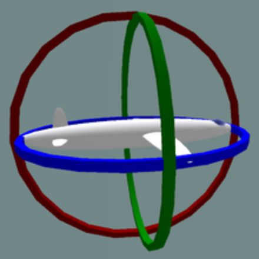
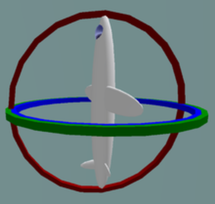

# 三维旋转表示

## 旋转矩阵

旋转矩阵包含两种意思：一是在固定坐标系下，向量的旋转；二是坐标系旋转，使得同一向量在不同坐标系下表示不同。

接下来首先讨论二维平面旋转表示，然后引申至三维。

### 向量旋转（外旋）

- 二维平面旋转
    

    $$
    \begin{equation*}
    \left\{
    \begin{aligned}
    x'={|OP|}\cdot{\cos(\alpha+\beta)}={|OP|}\cdot{(\cos\alpha\cos\beta-\sin\alpha\sin\beta)}={x}\cdot{\cos\beta}-{y}\cdot{\sin\beta}   \\
    y'={|OP|}\cdot{\sin(\alpha+\beta)}={|OP|}\cdot{(\sin\alpha\cos\beta+\cos\alpha\sin\beta)}={x}\cdot{\sin\beta}+{y}\cdot{\cos\beta}
    \end{aligned}
    \right.
    \end{equation*}
    $$

    转换成矩阵形式：

    $$
    \begin{bmatrix}
    x'\\
    y'
    \end{bmatrix}=
    {\begin{bmatrix}
    \cos\beta&-\sin\beta\\
    \sin\beta&\cos\beta
    \end{bmatrix}}\cdot
    {\begin{bmatrix}
    x\\
    y
    \end{bmatrix}}
    $$

    中间的矩阵为二维旋转矩阵，向量左乘该矩阵即为该向量逆时针旋转$\beta$角之后得到的向量。

    反向（顺时针）旋转：
    

    $$
    \begin{bmatrix}
    x'\\
    y'
    \end{bmatrix}=
    {\begin{bmatrix}
    \cos\beta&\sin\beta\\
    -\sin\beta&\cos\beta
    \end{bmatrix}}\cdot
    {\begin{bmatrix}
    x\\
    y
    \end{bmatrix}}
    $$

    注意到，该矩阵为正向旋转矩阵的逆矩阵，且为转置矩阵（因为旋转矩阵为正交矩阵）。

- 三维旋转
  
    为简化分析与计算，下面只考虑绕X、Y、Z轴的旋转。
    
    - 绕X轴
        

        $$
        \begin{equation*}
        \left\{
        \begin{aligned}
        &x' = x  \\
        &y'={|OP|}\cdot{\cos(\alpha+\beta)}={|OP|}\cdot{(\cos\alpha\cos\beta-\sin\alpha\sin\beta)}={y}\cdot{\cos\beta}-{z}\cdot{\sin\beta}   \\
        &z'={|OP|}\cdot{\sin(\alpha+\beta)}={|OP|}\cdot{(\sin\alpha\cos\beta+\cos\alpha\sin\beta)}={y}\cdot{\sin\beta}+{z}\cdot{\cos\beta}
        \end{aligned}
        \right.
        \end{equation*}
        $$

        $$
        \begin{bmatrix}
        x'\\
        y'\\
        z'
        \end{bmatrix}=
        {\begin{bmatrix}
        1&0&0\\
        0&\cos\beta&-\sin\beta\\
        0&\sin\beta&\cos\beta
        \end{bmatrix}}\cdot
        {\begin{bmatrix}
        x\\
        y\\
        z
        \end{bmatrix}}
        $$

    - 绕Y轴
        

        $$
        \begin{equation*}
        \left\{
        \begin{aligned}
        &x'={|OP|}\cdot{\sin(\alpha+\beta)}={|OP|}\cdot{(\sin\alpha\cos\beta+\cos\alpha\sin\beta)}={x}\cdot{\cos\beta}+{z}\cdot{\sin\beta}    \\
        &y'=y   \\
        &z'={|OP|}\cdot{\cos(\alpha+\beta)}={|OP|}\cdot{(\cos\alpha\cos\beta-\sin\alpha\sin\beta)}={x}\cdot{(-\sin\beta)}+{z}\cdot{\cos\beta}
        \end{aligned}
        \right.
        \end{equation*}
        $$

        $$
        \begin{bmatrix}
        x'\\
        y'\\
        z'
        \end{bmatrix}=
        {\begin{bmatrix}
        \cos\beta&0&\sin\beta\\
        0&1&0\\
        -\sin\beta&0&\cos\beta
        \end{bmatrix}}\cdot
        {\begin{bmatrix}
        x\\
        y\\
        z
        \end{bmatrix}}
        $$

    - 绕Z轴
        

        $$
        \begin{equation*}
        \left\{
        \begin{aligned}
        &x'={|OP|}\cdot{\cos(\alpha+\beta)}={|OP|}\cdot{(\cos\alpha\cos\beta-\sin\alpha\sin\beta)}={x}\cdot{\cos\beta}-{y}\cdot{\sin\beta}   \\
        &y'={|OP|}\cdot{\sin(\alpha+\beta)}={|OP|}\cdot{(\sin\alpha\cos\beta+\cos\alpha\sin\beta)}={x}\cdot{\sin\beta}+{y}\cdot{\cos\beta}   \\
        &z'=z
        \end{aligned}
        \right.
        \end{equation*}
        $$

        $$
        \begin{bmatrix}
        x'\\
        y'\\
        z'
        \end{bmatrix}=
        {\begin{bmatrix}
        \cos\beta&-\sin\beta&0\\
        \sin\beta&\cos\beta&0\\
        0&0&1
        \end{bmatrix}}\cdot
        {\begin{bmatrix}
        x\\
        y\\
        z
        \end{bmatrix}}
        $$

    - 三维旋转矩阵

        以上旋转矩阵都是在右手坐标系下计算的，三维旋转矩阵就由以上三个矩阵依次左乘得到，且逆时针为正，三维旋转矩阵表示为：

        $$
        M=
        {R_x(\alpha)}\cdot{R_y(\beta)}\cdot{R_z(\gamma)}=
        {\begin{bmatrix}
        1&0&0\\
        0&\cos\alpha&-\sin\alpha\\
        0&\sin\alpha&\cos\alpha
        \end{bmatrix}}\cdot
        {\begin{bmatrix}
        \cos\beta&0&\sin\beta\\
        0&1&0\\
        -\sin\beta&0&\cos\beta
        \end{bmatrix}}\cdot
        {\begin{bmatrix}
        \cos\gamma&-\sin\gamma&0\\
        \sin\gamma&\cos\gamma&0\\
        0&0&1
        \end{bmatrix}}
        $$

        上述表示向量先绕Z轴旋转$\gamma$角，再绕Y轴旋转$\beta$角，最后绕X轴旋转$\alpha$角的旋转矩阵。

### 坐标系旋转（内旋）

- 二维平面旋转
    

    矩阵表示为：

    $$
    \begin{bmatrix}
    x'&y'
    \end{bmatrix}=
    {\begin{bmatrix}
    x&y
    \end{bmatrix}}\cdot
    {\begin{bmatrix}
    \cos\beta&-\sin\beta\\
    \sin\beta&\cos\beta
    \end{bmatrix}}
    $$

- 三维旋转
  
    - 绕X轴
        

        $$
        \begin{bmatrix}
        x'&y'&z'
        \end{bmatrix}=
        {\begin{bmatrix}
        x&y&z
        \end{bmatrix}}\cdot
        {\begin{bmatrix}
        1&0&0\\
        0&\cos\beta&-\sin\beta\\
        0&\sin\beta&\cos\beta
        \end{bmatrix}}
        $$

    - 绕Y轴
        

        $$
        \begin{bmatrix}
        x'&y'&z'
        \end{bmatrix}=
        {\begin{bmatrix}
        x&y&z
        \end{bmatrix}}\cdot
        {\begin{bmatrix}
        \cos\beta&0&\sin\beta\\
        0&1&0\\
        -\sin\beta&0&\cos\beta
        \end{bmatrix}}
        $$

    - 绕Z轴
        

        $$
        \begin{bmatrix}
        x'&y'&z'
        \end{bmatrix}=
        {\begin{bmatrix}
        x&y&z
        \end{bmatrix}}\cdot
        {\begin{bmatrix}
        \cos\beta&-\sin\beta&0\\
        \sin\beta&\cos\beta&0\\
        0&0&1
        \end{bmatrix}}
        $$

    - 三维旋转矩阵

        以上旋转矩阵都是在右手坐标系下计算的，三维旋转矩阵就由以上三个矩阵依次右乘得到，且逆时针为正，三维旋转矩阵表示为：

        $$
        M=
        {R_x(\alpha)}\cdot{R_y(\beta)}\cdot{R_z(\gamma)}=
        {\begin{bmatrix}
        1&0&0\\
        0&\cos\alpha&-\sin\alpha\\
        0&\sin\alpha&\cos\alpha
        \end{bmatrix}}\cdot
        {\begin{bmatrix}
        \cos\beta&0&\sin\beta\\
        0&1&0\\
        -\sin\beta&0&\cos\beta
        \end{bmatrix}}\cdot
        {\begin{bmatrix}
        \cos\gamma&-\sin\gamma&0\\
        \sin\gamma&\cos\gamma&0\\
        0&0&1
        \end{bmatrix}}
        $$

        上述表示坐标系先绕X轴旋转$\alpha$角，再绕Y轴旋转$\beta$角，最后绕Z轴旋转$\gamma$角的旋转矩阵。

### 总结

- 外旋：绕固定坐标系旋转，左乘，坐标（向量）在变换。
- 内旋：绕当前坐标系旋转，右乘，坐标系（基底）在变换。
- Z-Y-X顺序的外旋等价于X-Y-Z顺序的内旋。

## 欧拉角

### 直观表示
以X、Y、Z轴旋转的角度表示三维空间的旋转，也就是Row、Pitch、Yaw的角度：

### 表示方式

欧拉角一般具有两大类表示方式,每类按照旋转次序的不同分为6小类:

Proper Euler angles (z-x-z, x-y-x, y-z-y, z-y-z, x-z-x, y-x-y)

Tait–Bryan angles (x-y-z, y-z-x, z-x-y, x-z-y, z-y-x, y-x-z)

每个大类都使用了3个变量描述三次旋转过程中的旋转角度, 差别在于Proper Euler angles只涉及两个转轴，而Tait–Bryan angles涉及三个转轴。

如果只给出一组欧拉角，绕x，y，z轴的转角为$(\alpha, \beta, \gamma)$，我们并不能确定其姿态，还需要知道旋转顺序以及内旋或外旋，才能确定这组欧拉角对应的姿态。

### 万向节死锁

万向锁（Gimbal Lock），当Pitch = ±90°时，绕第三个轴旋转的欧拉角和绕第一个轴旋转的欧拉角效果相同，即系统失去了一个自由度，出现了奇异性。

在使用欧拉角表示时，保证$Pitch\neq90°$，避免出现万向锁的问题。

## 四元数

## 三者关系